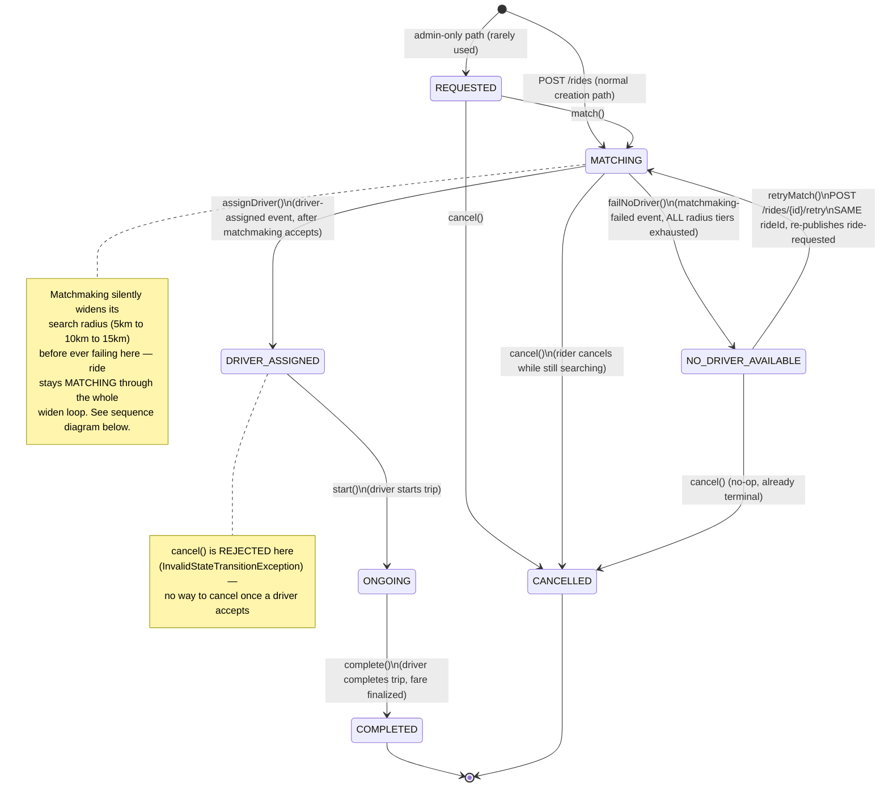
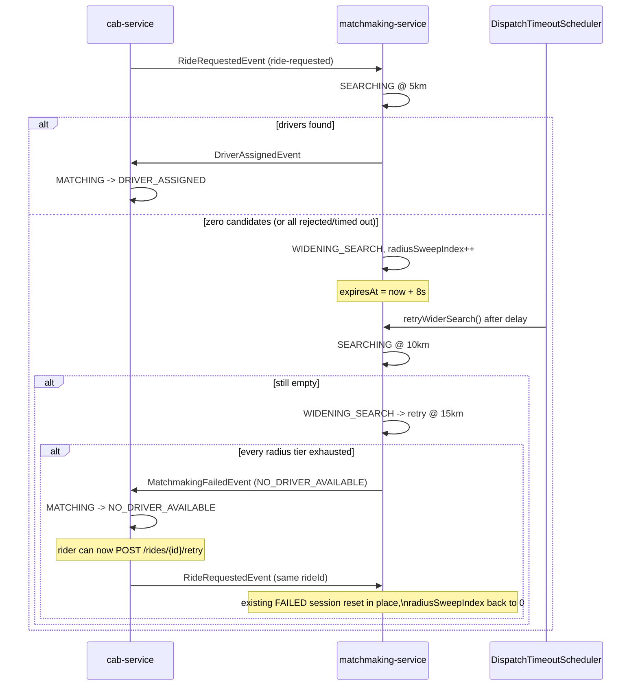

# 🚕 CAB SERVICE — HLD + LLD (Smart Mobility)

## 🏗️ High Level Design (HLD)

### 🎯 Purpose

Cab Service manages the **ride lifecycle**:

* Ride creation
* State transitions
* Ride orchestration
* Event publishing & consumption

---

## 📦 Responsibilities

### Core

* Create ride request
* Maintain ride state machine
* Handle ride lifecycle transitions
* Publish ride events
* Consume driver assignment events
* **Dispatch orchestration** - Handle driver response APIs
* **Publish driver-response events** - Forward to Matchmaking via Kafka

### Boundaries

* ❌ No driver selection logic (Matchmaking)
* ❌ No location tracking (Location Service)
* ❌ No notification handling

---

## 🔗 Inter-Service Communication

### Sync (REST)

* Gateway → Cab Service (user APIs)
* Cab Service → Matchmaking Service (`GET /internal/dispatch/{rideId}`) — attaches `X-Internal-Secret`
  header (see Security below)
* Realtime Gateway → Cab Service (`GET /rides/{rideId}` with `X-User-Id`) — verifies STOMP trip-topic
  ownership; reuses this endpoint's existing rider-or-driver check rather than duplicating it

### Async (Kafka)

**Produces:**

* ride-requested
* assignment-accepted (driver response)
* assignment-rejected (driver response)
* ride-started (future)
* ride-completed — **now implemented**, published on `completeRide()`; tells matchmaking-service to release
  the driver's on-trip reservation
* ride-cancelled — **now implemented**, published on `cancelRide()` when a driver had already been assigned;
  same purpose as ride-completed, for the cancel path

**Consumes:**

* driver-assigned
* matchmaking-failed

### Security — Internal API Auth

Outbound calls to matchmaking-service's `/internal/dispatch/{rideId}` now attach an `X-Internal-Secret`
header (`MatchmakingServiceClient`, switched from `RestTemplate.getForEntity` to `.exchange` to allow the
header). matchmaking-service verifies this header itself — the API Gateway's path-block was previously the
only thing stopping a direct, unauthenticated call to that endpoint from anywhere on the network.

---

## 🧠 Ride State Model

`RideStatus` enum: `REQUESTED, MATCHING, DRIVER_ASSIGNED, ONGOING, COMPLETED, CANCELLED, NO_DRIVER_AVAILABLE`.

`POST /rides` sets status **directly to `MATCHING`** (`RideMapper.toEntity`) — `REQUESTED` is not actually
reached by normal ride creation; it only exists for the separate admin-only `POST /rides/{id}/match` path.



### Cross-service: the widen-then-retry flow (matchmaking-service)

`RideStatus.MATCHING` maps to a much busier internal state machine in matchmaking-service
(`DispatchStatus`), invisible to the rider until it's exhausted:



### Known gap: cancelling before a driver is assigned doesn't stop the search

`cancelRide()` only publishes `RideCancelledEvent` to matchmaking `if (driverUserId != null)`. Cancelling
while still `MATCHING` — the common case, since that's exactly when a rider would want to cancel — never
notifies matchmaking. Its dispatch session keeps running (including the widen loop above) and keeps
offering the cancelled ride to drivers. If one eventually accepts, `handleDriverAssignedEvent` calls
`state.assignDriver()` on a ride that's already `CANCELLED`, which throws `InvalidStateTransitionException`
with no defined recovery path. Not fixed as part of the widen/retry feature — flagged here for follow-up.

---

## 🗄️ Storage Strategy

### PostgreSQL

* Ride data
* Ride state
* Metadata

### (Optional Future)

* Outbox table (event reliability)

---

## ⚙️ High-Level Flow

### Ride Creation

User → Cab Service → DB → Kafka (ride-requested)

---

### Driver Assignment

Kafka → Cab Service → State transition → DRIVER_ASSIGNED

---

### Ride Lifecycle

Driver → Start/Complete → Cab Service → State update

---

# 🧱 Low Level Design (LLD)

## 📁 Package Structure

```
cab-service/
├── controller/
├── service/
├── repository/
├── entity/
├── dto/
├── mapper/
├── state/
├── event/
├── producer/
├── consumer/
├── config/
├── exception/
```

---

## 🗄️ Database Schema

### rides

```sql
CREATE TABLE rides (
    id UUID PRIMARY KEY,
    rider_id UUID NOT NULL,
    driver_id BIGINT,
    pickup_location VARCHAR(255),
    pickup_latitude DOUBLE,
    pickup_longitude DOUBLE,
    drop_location VARCHAR(255),
    drop_latitude DOUBLE,
    drop_longitude DOUBLE,
    status VARCHAR(50),
    created_at TIMESTAMP,
    updated_at TIMESTAMP
);
```

---

### processed_events (Idempotency)

```sql
CREATE TABLE processed_events (
    event_id VARCHAR PRIMARY KEY,
    event_type VARCHAR(100),
    processed_at TIMESTAMP
);
```

---

## ⚙️ State Machine (Core Logic)

### RideState Interface

```java
interface RideState {
    void match(RideEntity ride);
    void assignDriver(RideEntity ride, Long driverUserId);
    void start(RideEntity ride);
    void complete(RideEntity ride);
    void cancel(RideEntity ride);
    void failNoDriver(RideEntity ride);
    void retryMatch(RideEntity ride); // rider-initiated "search again" — only valid from NO_DRIVER_AVAILABLE
}
```

---

### State Implementations

| State                | Allowed Actions              |
| --------------------- | ----------------------------- |
| REQUESTED             | match, cancel                 |
| MATCHING              | assignDriver, cancel, failNoDriver |
| DRIVER_ASSIGNED       | start (cancel is **rejected** — no cancellation once a driver accepts) |
| ONGOING               | complete                      |
| COMPLETED             | none (terminal)                |
| CANCELLED             | none (terminal)                |
| NO_DRIVER_AVAILABLE   | retryMatch, cancel (no-op)     |

---

## 🌐 APIs

### Create Ride (Rider)

```
POST /api/rides
```

---

### Get Ride (Rider)

```
GET /api/rides/{id}
```

---

### Cancel Ride (Rider)

```
POST /api/rides/{id}/cancel
```

---

### Retry Match (Rider)

Only valid when ride status is `NO_DRIVER_AVAILABLE`. Transitions back to `MATCHING` and re-publishes
`ride-requested` for the same rideId — matchmaking-service resets its existing failed dispatch session in
place and restarts the radius sweep from tier 0, rather than the rider creating an entirely new ride.

```
POST /rides/{id}/retry
```

---

### Match Ride (internal)

```
POST /rides/{id}/match
```

---

### Start Ride

```
POST /rides/{id}/start
```

---

### Complete Ride

```
POST /rides/{id}/complete
```

---

### Driver Response (Driver) 🚨 MOVED FROM MATCHMAKING

```
POST /dispatch/driver-response
Body: { "dispatchId": "uuid", "driverId": 123, "response": "ACCEPT|REJECT" }
```

---

### Cancel Dispatch (Rider)

```
POST /dispatch/cancel
Body: { "rideId": "uuid", "reason": "string" }
```

---

### Get Dispatch Status

```
GET /dispatch/{rideId}
```

---

## ⚙️ Service Logic

### Create Ride

```java
save ride;
publish ride-requested;
```

---

### Assign Driver

```java
state.assignDriver();
save ride;
```

---

### Start Ride

```java
state.start();
save ride;
```

---

### Complete Ride

```java
state.complete();
save ride;
```

---

## 📡 Kafka Events

### ride-requested (Produced)

```json
{
  "eventId": "uuid",
  "rideId": "uuid",
  "riderId": "uuid",
  "pickupLocation": "string",
  "pickupLatitude": 28.7041,
  "pickupLongitude": 77.1025,
  "dropLocation": "string",
  "dropLatitude": 28.5355,
  "dropLongitude": 77.3910
}
```

---

### driver-assigned (Consumed)

```json
{
  "eventId": "uuid",
  "rideId": "uuid",
  "driverUserId": 12345,
  "assignedAt": "2024-01-01T12:00:00"
}
```

### matchmaking-failed (Consumed)

```json
{
  "eventId": "uuid",
  "rideId": "uuid",
  "reason": "NO_DRIVER_AVAILABLE",
  "failedAt": "2024-01-01T12:00:00"
}
```

### ride-completed (Produced)

```json
{
  "eventId": "uuid",
  "rideId": "uuid",
  "driverUserId": 12345,
  "riderUserId": 6789,
  "completedAt": "2026-08-08T11:59:11.410937251"
}
```
> Published from `completeRide()` after the ride is saved as COMPLETED. Sole purpose: tell
> matchmaking-service to release the driver's on-trip Redis reservation right now, instead of
> waiting for its safety-net TTL to expire.

### ride-cancelled (Produced)

```json
{
  "eventId": "uuid",
  "rideId": "uuid",
  "driverUserId": 12345,
  "cancelledAt": "2026-08-08T11:59:11.410937251"
}
```
> Published from `cancelRide()`, **only if a driver had already been assigned** — no point notifying
> matchmaking about a ride that never had a reservation to release.

---

## ⚡ Kafka Flow

```
Cab Service → ride-requested → Matchmaking
Matchmaking → driver-assigned → Cab Service
Matchmaking → matchmaking-failed → Cab Service

Driver → /dispatch/driver-response → Cab Service → assignment-accepted → Matchmaking
Driver → /dispatch/driver-response → Cab Service → assignment-rejected → Matchmaking

Driver → /rides/{id}/complete → Cab Service → ride-completed → Matchmaking (release reservation)
Rider  → /rides/{id}/cancel   → Cab Service → ride-cancelled → Matchmaking (release reservation, if assigned)
```

### Complete Event Flow

| Event | Producer | Consumer | Purpose |
|-------|----------|----------|---------|
| ride-requested | Cab Service | Matchmaking | Trigger matching |
| driver-assigned | Matchmaking | Cab Service | Update ride status |
| matchmaking-failed | Matchmaking | Cab Service | Handle no driver |
| assignment-accepted | Cab Service | Matchmaking | Driver accepted |
| assignment-rejected | Cab Service | Matchmaking | Retry next driver |
| ride-completed | Cab Service | Matchmaking | Release driver's on-trip reservation |
| ride-cancelled | Cab Service | Matchmaking | Release driver's on-trip reservation (if assigned) |

---

## 🔒 Concurrency

### Idempotency

```text
processed_events table prevents duplicate event processing
```

---

### State Safety

```text
State machine enforces valid transitions
```

---

## 🧠 Patterns Used

* State Machine Pattern (core)
* Strategy Pattern (future fare logic)
* Factory Pattern (state factory)
* Observer Pattern (Kafka)
* Repository Pattern
* Service Layer Pattern

---

## ⚠️ Failure Handling

* Kafka retry
* DLQ (Dead Letter Queue)
* Idempotent consumers
* Transactional service methods

---

## 🔑 Key Insights

* Cab Service = **state owner**
* Event-driven lifecycle
* Strict separation from matchmaking
* State machine ensures correctness
* Designed for scalability & consistency

---
