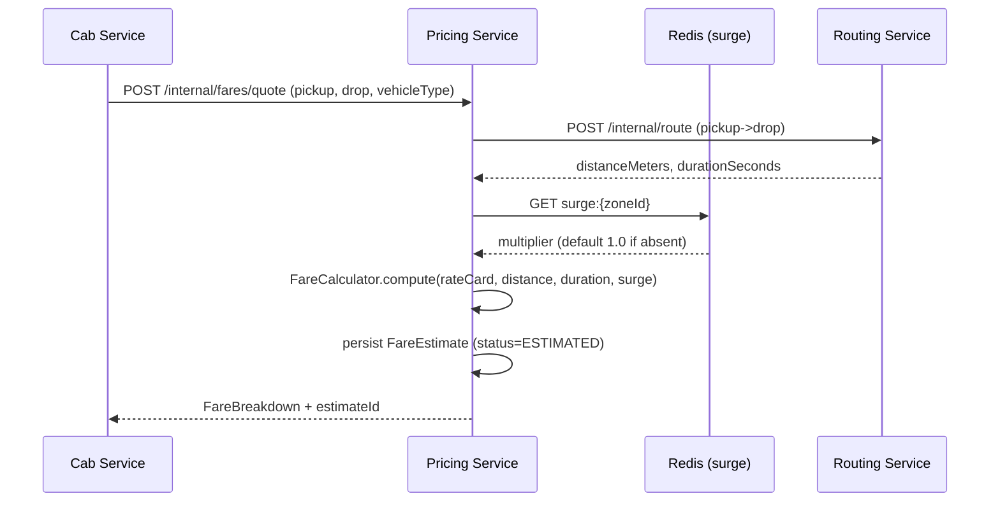
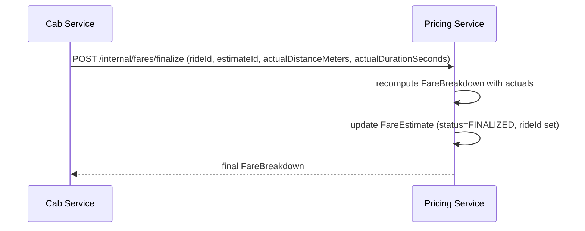

# Pricing Service HLD

## 1. Overview
The **Pricing Service** computes ride fares: an upfront estimate at booking time and a finalized fare at ride completion. It owns the fare domain — rate cards, surge multipliers, fare audit records — so `cab-service` and `payment-service` never re-implement pricing logic. Follows the same internal-REST-facade convention as `routing-service`, plus durable storage for the audit trail (Postgres) and hot surge lookups (Redis), matching the HLD's existing port/tech entry (`:8092`, Spring Boot + Redis).

## 2. Core Responsibilities
- **Fare Estimation**: Given pickup/drop coordinates + vehicle type, call `routing-service` for distance/duration, apply rate card + surge, return upfront quote.
- **Fare Finalization**: At ride completion, recompute with actual trip distance/duration (from `cab-service`/`routing-service`), persist final fare, return to caller.
- **Surge Management**: Maintain per-zone surge multipliers in Redis (TTL-based), updatable by an internal admin/ops endpoint or a future demand-signal job — out of scope for v1 beyond read/write API.
- **Rate Cards**: Per-vehicle-type base fare, per-km rate, per-min rate, minimum fare, cancellation fee — stored in Postgres, cached in Redis.
- **Fare Audit Trail**: Every estimate + finalized fare persisted for payment reconciliation and dispute resolution.

## 3. Domain Model
Kept intentionally light — this is a CRUD-adjacent calculation service, not a complex aggregate domain. Full Clean Architecture layering (entities/use-cases/adapters/infra as separate top-level packages) would be over-engineering here; instead apply the *dependency rule* within the existing per-service package convention used by `cab-service`/`matchmaking-service`.

**Value Objects** (immutable, no framework deps):
- `Money` — amount (paise/cents as long) + currency, arithmetic methods, no negative amounts.
- `FareBreakdown` — baseFare, distanceFare, timeFare, surgeAmount, total (all `Money`), surgeMultiplier applied.

**Entities**:
- `FareEstimate` (Postgres) — id, rideId (nullable pre-booking), pickup/drop coords, vehicleType, breakdown, status(ESTIMATED/FINALIZED/EXPIRED), createdAt.
- `RateCard` (Postgres, admin-managed) — vehicleType, baseFare, perKmRate, perMinRate, minFare, cancellationFee, active.

**Domain logic** lives in a `FareCalculator` (plain class, unit-testable, no Spring annotations) — takes distance/duration/rateCard/surgeMultiplier, returns `FareBreakdown`. This is the one piece worth isolating from frameworks since it's the part with actual business rules and the highest test-value.

## 4. Package Structure
```
pricing-service/src/main/java/com/smartmobility/pricing/
├── controller/        # PricingController (/internal/fares/**), SurgeController (/internal/surge/**)
├── service/
│   └── impl/          # PricingServiceImpl — orchestrates calculator + repo + redis + routing client
├── domain/
│   └── FareCalculator.java     # pure business logic, no Spring deps
├── entity/             # FareEstimateEntity, RateCardEntity (JPA)
├── repository/         # FareEstimateRepository, RateCardRepository
├── dto/                # FareQuoteRequest/Response, QuoteAllRequest/Response, FareFinalizeRequest/Response, Coordinate, ApiResponse
├── client/             # RoutingServiceClient (mirrors matchmaking-service's pattern)
├── redis/              # SurgeCacheService (get/set multiplier per zone, TTL)
├── config/             # RestClientConfig, InternalApiSecurityFilter, DataSeeder (seeds default rate cards on startup)
└── exception/          # RateCardNotFoundException, GlobalExceptionHandler
```
`FareCalculator` returns fields directly on `FareQuoteResponse`/`FareEstimateEntity` (baseFare, distanceFare, timeFare, surgeAmount, totalFare, surgeMultiplier) rather than a separate `FareBreakdown` value object.
**Dependency rule**: `domain/` has zero imports from `entity/`, `repository/`, `client/`, or Spring — `service/impl` maps DTOs/entities into domain types, calls `FareCalculator`, maps back. This keeps fare-math testable without Postgres/Redis/HTTP mocks, without forcing the rest of the codebase's simpler layering to change.

## 5. Tech Stack
- **Framework**: Spring Boot 3, Spring Data JPA
- **Cache**: Redis (surge multipliers, rate-card read cache)
- **Database**: PostgreSQL (fare audit, rate cards) — reuse `docker/init.sql` pattern, new `pricing_service` schema/DB
- **Network Client**: Spring `RestClient` → `routing-service` (Eureka-resolved), same retry pattern as `matchmaking-service`'s `RoutingServiceClient`
- **Service Discovery**: Eureka (peer1/peer2)
- **Tracing**: Zipkin (already wired platform-wide)

## 6. Architecture and Flow

### 6.1 Upfront Quote (at booking)


### 6.2 Finalize (at ride completion)

`cab-service` calls both endpoints synchronously via `RestClient` + Eureka, same integration style as `matchmaking-service → routing-service`. No Kafka involvement for v1 — keeps the fare path simple and synchronous end to end.

## 7. API Endpoints (Internal Only)
All endpoints require `X-Internal-Secret` header, same filter as `routing-service`/`location-service`.

### 7.1 `POST /internal/fares/quote`
```json
// Request
{ "pickupLat": 12.9716, "pickupLng": 77.5946, "dropLat": 12.9352, "dropLng": 77.6244, "vehicleType": "SEDAN" }
// Response
{ "success": true, "data": { "estimateId": "uuid", "breakdown": { "baseFare": 5000, "distanceFare": 12000, "timeFare": 3000, "surgeAmount": 4000, "total": 24000, "surgeMultiplier": 1.2 }, "currency": "INR" } }
```

### 7.2 `POST /internal/fares/finalize`
```json
// Request
{ "rideId": "uuid", "estimateId": "uuid", "actualDistanceMeters": 4600.0, "actualDurationSeconds": 980 }
// Response
{ "success": true, "data": { "breakdown": { ... }, "total": 25400 } }
```

### 7.3 `POST /internal/fares/quote-all` — quote every active vehicle type in one call (`QuoteAllRequest`/`QuoteAllResponse`), avoids N sequential `/quote` calls when `cab-service` shows a fare comparison across vehicle types

### 7.4 `GET /internal/fares/{rideId}` — audit lookup, returns the full `FareEstimateEntity` (for `payment-service` reconciliation)

### 7.5 `PUT /internal/surge/{zoneId}` (`SurgeController`) — ops-only, params `multiplier` + `ttlSeconds` (default 600), sets multiplier + TTL in Redis via `SurgeCacheService`

## 8. Data Model
**Postgres** (`pricing_service` DB):
- `rate_cards(vehicle_type PK, base_fare, per_km_rate, per_min_rate, min_fare, cancellation_fee, active, updated_at)` — seeded on startup by `DataSeeder`
- `fare_estimates(id UUID PK, ride_id UNIQUE, pickup_lat, pickup_lng, drop_lat, drop_lng, vehicle_type, base_fare, distance_fare, time_fare, surge_amount, total_fare, surge_multiplier, status, created_at, updated_at)` — `status` ∈ `ESTIMATED`/`FINALIZED`/`EXPIRED`

**Redis keys**:
- `surge:{zoneId}` → multiplier float, TTL ~10 min (re-evaluated by future demand job)
- `ratecard:{vehicleType}` → cached RateCard JSON, TTL ~5 min, invalidated on admin update

## 9. Resilience and Observability
- If `routing-service` call fails/times out: fall back to Haversine straight-line distance × 1.15 padding factor, flag `estimateSource=FALLBACK` in response so `cab-service` can show "approximate fare" UI.
- If Redis surge lookup fails: default multiplier = 1.0 (never block a quote on cache unavailability).
- `RateCardNotFoundException` → 404, `cab-service` should block booking for that vehicle type.
- Zipkin traces the quote→routing round-trip, same as matchmaking's routing calls.
- Client-side retry (max 3 attempts) on `routing-service` calls, matching `matchmaking-service`'s existing policy.

## 10. Build Status — Implemented
All items below are built and wired, not pending:
1. `pricing-service` module scaffolded, Eureka-registered, port 8092.
2. `pricing_service` DB + `rate_cards`/`fare_estimates` tables; `docker-compose.yml` service block (depends_on postgres+redis+eureka).
3. `FareCalculator` implemented as pure domain logic (no Spring deps).
4. `RoutingServiceClient`, `SurgeCacheService`, repositories, `PricingServiceImpl`, `PricingController`, `SurgeController` implemented.
5. `InternalApiSecurityFilter` wired on all `/internal/**` endpoints.
6. Gateway route for pricing-service present in `gateway-service/src/main/resources/application.properties`.
7. `cab-service` wired via `client/PricingServiceClient.java`, called from `RideServiceImpl`.
8. `rate_cards` seeded on startup via `config/DataSeeder.java` (not `init.sql`).

**Not yet verified/open items:**
- Quote latency NFR (<200ms) not load-tested against this specific endpoint (general pressure scripts exist under `scripts/` but not pricing-specific).
- Fallback path confirmed implemented (`fallbackHaversineRoute` in `PricingServiceImpl`, `estimateSource="FALLBACK"` vs `"VALHALLA"`) — not yet exercised under a chaos/kill test.
- No admin/ops auth beyond the shared `X-Internal-Secret` on `PUT /internal/surge/{zoneId}` — anyone with the internal secret can move surge pricing; fine for internal-only v1, revisit if this is ever exposed further.
