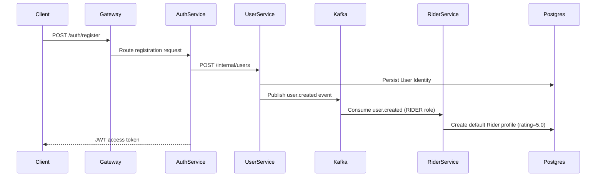

# 👤 RIDER SERVICE — HLD + LLD (Smart Mobility)

## Service Configuration

* **Port:** 8082
* **Database:** PostgreSQL

---

# 🏗️ High Level Design (HLD)

## 🎯 Purpose

Rider Service manages the lifecycle, profiles, and preferences of the system's **riders**:

* Rider-specific domain profile management (rating, tier, preferences)
* Saved/frequent locations (Home, Work, etc.)
* Preferred payment profiles/methods
* Decoupling rider-specific attributes from core User accounts

---

## 📦 Responsibilities

### Core

* Automatic onboarding of riders when a new user registers with the `RIDER` role
* Management of saved addresses/locations (Home, Work, Gym, etc.)
* Management of rider preferences (e.g., preferred payment method)
* Maintaining the rider's overall system rating

### Boundaries

* ❌ No authentication (handled by auth-service)
* ❌ No driver domain logic (handled by driver-service)
* ❌ No ride booking or dispatch state (handled by cab-service)
* ❌ No billing or payment gateway execution (handled by payment-service in the future)

---

## 🔗 Inter-Service Communication

### Sync (REST)

* **Gateway → Rider Service:** Retrieve and update profiles, saved locations, and preferences.
* **Cab Service → Rider Service:** (Optional) Retrieve rider rating or tier when establishing fares/matching.

---

### Async (Kafka)

**Consumes:**

* `user.created` (To automatically seed a new Rider profile with defaults)

**Produces:**

* `rider.profile.updated` (Future, to sync updates to other services if necessary)

---

## 🧠 Rider Lifecycle Flow



---

## 🗄️ Storage Strategy

### PostgreSQL

* Rider profiles (rating, payment preferences, metadata)
* Rider saved locations (label, address, coordinates)

---

# 🧱 Low Level Design (LLD)

## 📁 Package Structure

```
rider-service/
├── controller/
├── service/
├── service/impl/
├── repository/
├── entity/
├── dto/
├── mapper/
├── kafka/
├── config/
├── exception/
```

---

## 🗄️ Database Schema

### riders

```sql
CREATE TABLE riders (
    id BIGSERIAL PRIMARY KEY,
    user_id BIGINT UNIQUE NOT NULL,
    rating DOUBLE PRECISION DEFAULT 5.0 NOT NULL,
    preferred_payment_method VARCHAR(30) DEFAULT 'CASH' NOT NULL,
    created_at TIMESTAMP NOT NULL,
    updated_at TIMESTAMP NOT NULL
);

-- Index for fast user-to-rider resolution
CREATE INDEX idx_riders_user_id ON riders(user_id);
```

### rider_saved_locations

```sql
CREATE TABLE rider_saved_locations (
    id BIGSERIAL PRIMARY KEY,
    rider_id BIGINT NOT NULL,
    label VARCHAR(50) NOT NULL, -- e.g., 'Home', 'Work', 'Gym'
    address VARCHAR(255) NOT NULL,
    latitude DOUBLE PRECISION NOT NULL,
    longitude DOUBLE PRECISION NOT NULL,
    created_at TIMESTAMP NOT NULL,
    updated_at TIMESTAMP NOT NULL,
    CONSTRAINT fk_rider_saved_locations_rider FOREIGN KEY (rider_id) REFERENCES riders(id) ON DELETE CASCADE
);

-- Index for retrieving locations of a specific rider
CREATE INDEX idx_saved_locations_rider_id ON rider_saved_locations(rider_id);
-- Unique constraint to prevent duplicate labels per rider
CREATE UNIQUE INDEX uk_rider_label ON rider_saved_locations(rider_id, UPPER(label));
```

---

## 🌐 APIs

### Get Rider Profile

```
GET /riders/me
Headers: X-User-Id (passed by Gateway)
```

### Update Rider Preferences

```
PATCH /riders/me/preferences
Headers: X-User-Id
Body:
{
  "preferredPaymentMethod": "CARD"
}
```

### Get Saved Locations

```
GET /riders/me/locations
Headers: X-User-Id
```

### Add Saved Location

```
POST /riders/me/locations
Headers: X-User-Id
Body:
{
  "label": "Work",
  "address": "123 Tech Park Ave, Silicon Valley",
  "latitude": 37.7749,
  "longitude": -122.4194
}
```

### Delete Saved Location

```
DELETE /riders/me/locations/{locationId}
Headers: X-User-Id
```

---

## ⚙️ Service Logic

### Onboarding via Kafka Consumer

```java
@KafkaListener(topics = "user.created", groupId = "rider-service-group")
public void handleUserCreated(UserCreatedEvent event) {
    if (event.getRoles().contains("RIDER")) {
        RiderEntity rider = RiderEntity.builder()
            .userId(event.getUserId())
            .rating(5.0)
            .preferredPaymentMethod(PaymentMethod.CASH)
            .build();
        riderRepository.save(rider);
        log.info("Successfully created rider profile for user: {}", event.getUserId());
    }
}
```

---

## 📡 Kafka Events

### user.created (Consumed)

```json
{
  "eventId": "3c9b74df-df13-4029-a1b7-a3f1246e492b",
  "userId": 105,
  "email": "rider.jane@example.com",
  "roles": ["RIDER"]
}
```

---

## 🔒 Concurrency & Constraints

* **Strict 1:1 Mapping:** The `user_id` in `riders` is set to `UNIQUE` to prevent a user from having more than one rider profile.
* **Label Uniqueness:** An index on `(rider_id, UPPER(label))` ensures a rider cannot create multiple locations with duplicate names (e.g., two "Home"s).

---

## 🧠 Patterns Used

* **Event-Driven Architecture (Kafka):** For loose decoupling and reliable profile creation during signup.
* **Repository Pattern (Spring Data JPA):** For PostgreSQL persistence.
* **Service Layer Pattern:** Separating presentation and business logic.
* **CQRS (Logical Separation):** Keeping core profile reads/writes separated from heavy location coordinates lookup.

---

## ⚠️ Failure Handling

* **Idempotent Kafka Consumer:** If `user.created` is redelivered, the database constraint `UNIQUE(user_id)` will throw a constraint violation, which is caught to ensure idempotency without creating duplicate rider rows.
* **Outbox Pattern (Future):** To emit updates if downstream systems (e.g. matchmaking or promo services) need to listen to rider status changes.

---

## 🔑 Key Insights

* **Symmetrical Decoupling:** Paralleling the `Driver Service`, this design ensures the `User Service` remains 100% focused on Authentication and Identity, while role-specific metadata is distributed.
* **High Extensibility:** Placing locations and payment methods inside the Rider domain makes it trivial to later add promo codes, rider credit balances, or monthly subscriptions.
