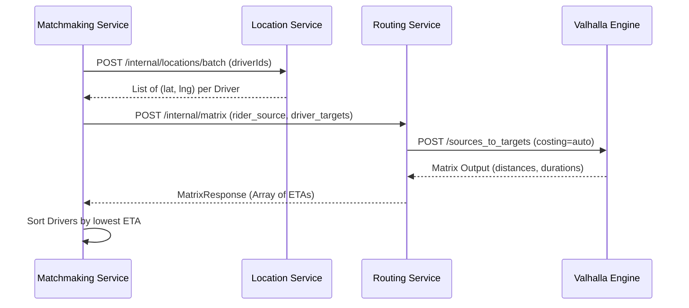

# Routing Service HLD

## 1. Overview
The **Routing Service** is a stateless internal microservice that acts as an abstraction and REST facade over the Valhalla routing engine. It is responsible for calculating exact road-network-aware ETAs, distances, and polylines for drivers and riders.

By delegating these complex GIS and spatial calculations to Valhalla, the Routing Service prevents the rest of the ecosystem (Matchmaking, Dispatch, and Pricing) from being burdened with OSM map data processing or Haversine inaccuracies.

## 2. Core Responsibilities
- **Matrix ETA Calculation**: Accepts a single origin (e.g., Rider pickup location) and multiple targets (e.g., Candidate Drivers) to compute the exact travel time array using the `sources_to_targets` Matrix API.
- **Pathfinding & Polylines**: Calculates turn-by-turn routes, total distance, and shape polylines for active trips using the `/route` API.
- **Service Isolation**: Secures Valhalla behind the Smart Mobility internal network, exposing only strictly necessary operations to other internal services.

## 3. Tech Stack
- **Framework**: Spring Boot 4.0.5
- **Network Client**: Spring `RestClient` for high-performance HTTP communication with Valhalla.
- **Infrastructure**: No Databases, No Redis, No Kafka. Pure stateless synchronous processing.
- **Map Engine**: Valhalla Docker Image (pre-compiled with Southern India OSM data).

## 4. Architecture and Flow

### 4.1 Matchmaking Integration (Matrix ETA)
When a ride is requested, `matchmaking-service` uses the `location-service` to get a coarse list of drivers (Haversine bounding box). It then calls the `routing-service` to rank those drivers accurately by road distance:



### 4.2 Future Pricing Integration (Fare Calculation)
The `pricing-service` will use `routing-service` to generate upfront price estimates based on exact route meters and expected traffic conditions.

## 5. API Endpoints (Internal Only)

All endpoints require the `X-Internal-Secret` header.

### 5.1 `POST /internal/matrix`
Calculates distance/ETA from $N$ sources to $M$ targets.

**Request:**
```json
{
  "sources": [
    { "lat": 12.971598, "lng": 77.594562 }
  ],
  "targets": [
    { "lat": 12.972442, "lng": 77.580643 },
    { "lat": 12.969123, "lng": 77.598765 }
  ],
  "costingModel": "auto"
}
```

**Response:**
```json
{
  "success": true,
  "data": {
    "distancesMeters": [[1540.2, 850.5]],
    "durationsSeconds": [[310.5, 180.2]]
  }
}
```

### 5.2 `POST /internal/route`
Returns a polyline and exact route path.

**Request:**
```json
{
  "originLat": 12.971598,
  "originLng": 77.594562,
  "destLat": 12.935192,
  "destLng": 77.624480,
  "costingModel": "auto"
}
```

**Response:**
```json
{
  "success": true,
  "data": {
    "polyline": "encoded_polyline_string",
    "distanceMeters": 4500.5,
    "durationSeconds": 950.0,
    "legs": [
      {
        "distanceMeters": 4500.5,
        "durationSeconds": 950.0
      }
    ]
  }
}
```

## 6. Resilience and Observability
- Distributed Tracing (Zipkin) tracks Matrix request latency across the network.
- Both hops retry 3x on 5xx/network errors with a 250ms backoff and record `dependency.client.duration` metrics: `matchmaking-service → routing-service` (`RoutingServiceClient`) and `routing-service → Valhalla` (`ValhallaClient`).
- If Valhalla is unavailable after retries, `RoutingServiceClient.getDurationsSeconds` returns `Optional.empty()` rather than a fabricated value — `DispatchServiceImpl.rankDrivers` falls back to the original unranked driver order (from Redis GEO discovery order) instead of sorting on fake data. No straight-line-distance fallback exists; degraded mode is "unranked", not "Haversine-ranked".

## 7. Future Additions
- **Live traffic-aware ETA**: deferred. Valhalla and GraphHopper open-source cores both lack a documented, stable API for injecting live edge speeds (only unmaintained CLI/forum-sourced hacks exist on either engine) — evaluated and rejected for now. Revisit via a vendor routing API that returns traffic-aware ETA natively (Google Routes / HERE / TomTom Routing) if traffic accuracy becomes a priority worth the per-request cost, rather than re-attempting a self-hosted traffic-tile pipeline.
- **Multi-leg / waypoint routing**: `/internal/route` and `RoutingServiceImpl.getRoute` assume exactly one leg (`trip.getLegs().get(0)` for the polyline) since the API only accepts a single origin/destination pair. Add waypoint support (`RouteRequest.waypoints`) if a caller needs multi-stop routes, and stitch/return per-leg polylines instead of just the first.
- **Driver GPS map-matching**: Valhalla's `/trace_attributes` can snap noisy raw driver GPS onto road centerlines. Not built — would add a Valhalla round-trip to every `location-service` GPS ping. Add only if map jitter becomes a real product problem.
- **Public gateway route**: currently `/internal/**` only, called service-to-service. Add a `gateway-service` route (`/routing/**`) only if a client app needs to fetch a route/polyline directly (e.g. rider fare-preview screen before requesting a ride).
- **OSM tile refresh automation**: tile rebuilds are currently manual (bump `tile_urls`, `docker compose restart valhalla`). Automate to a scheduled job with blue/green tile-directory swap once rebuild cadence becomes a recurring operational task.
- **Request validation**: no server-side check that `costingModel` is a Valhalla-supported profile, or that `MatrixRequest` source/target counts stay under Valhalla's configured matrix size limit — both currently surface as opaque Valhalla 400s via `GlobalExceptionHandler` rather than an early, descriptive validation error.
