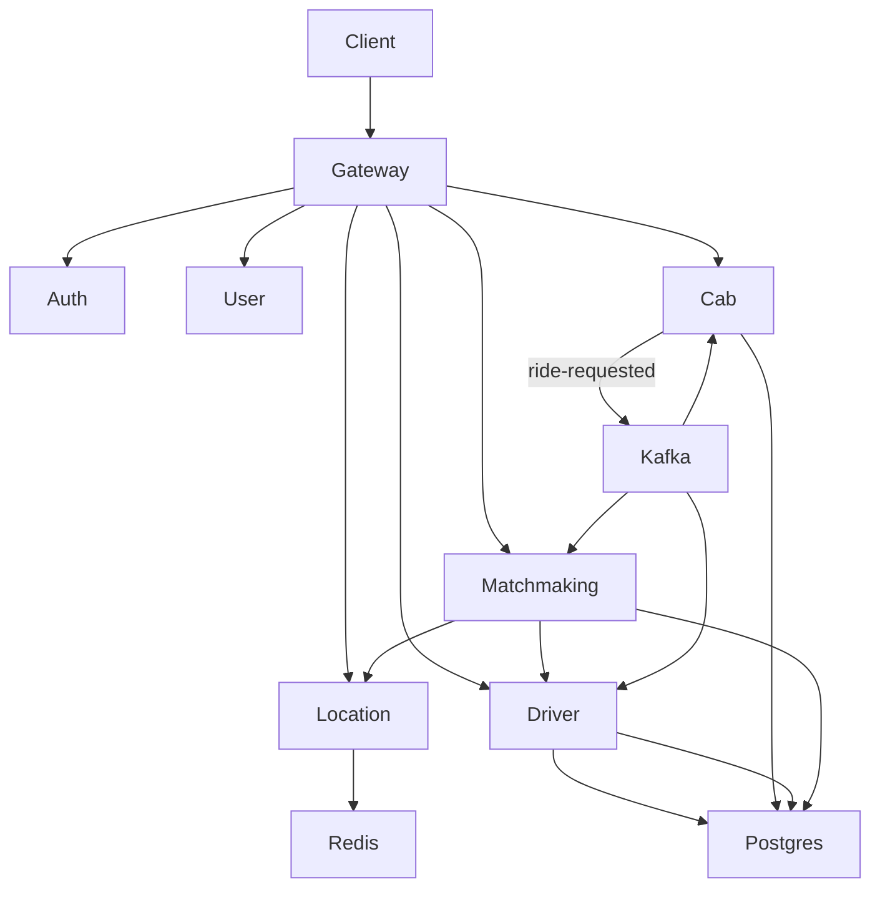
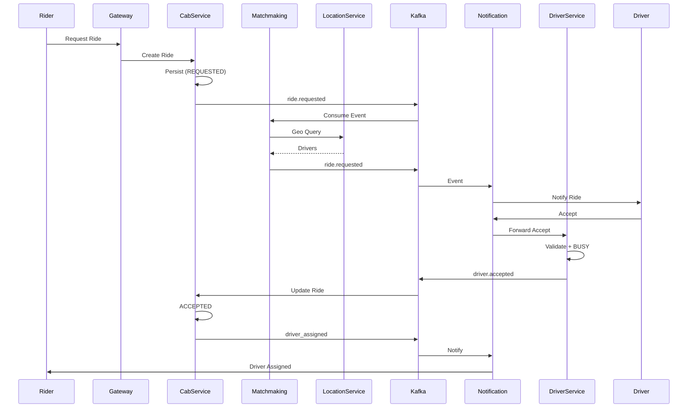
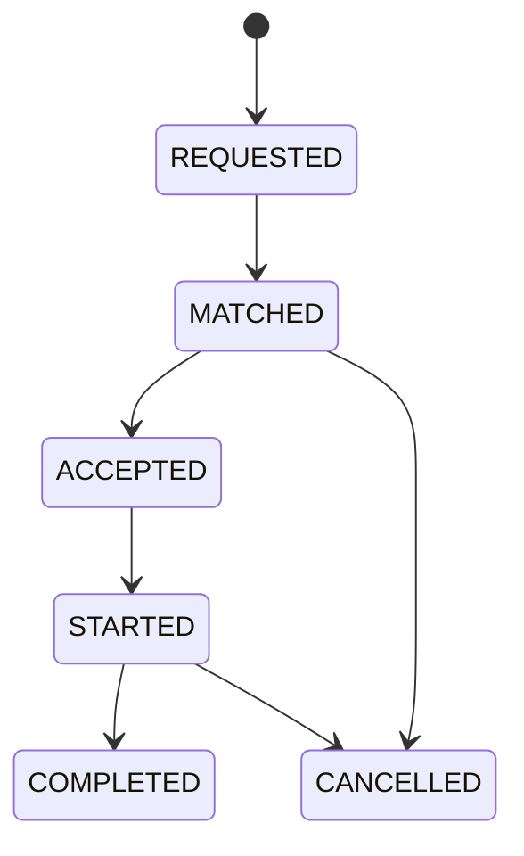
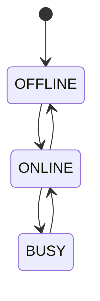
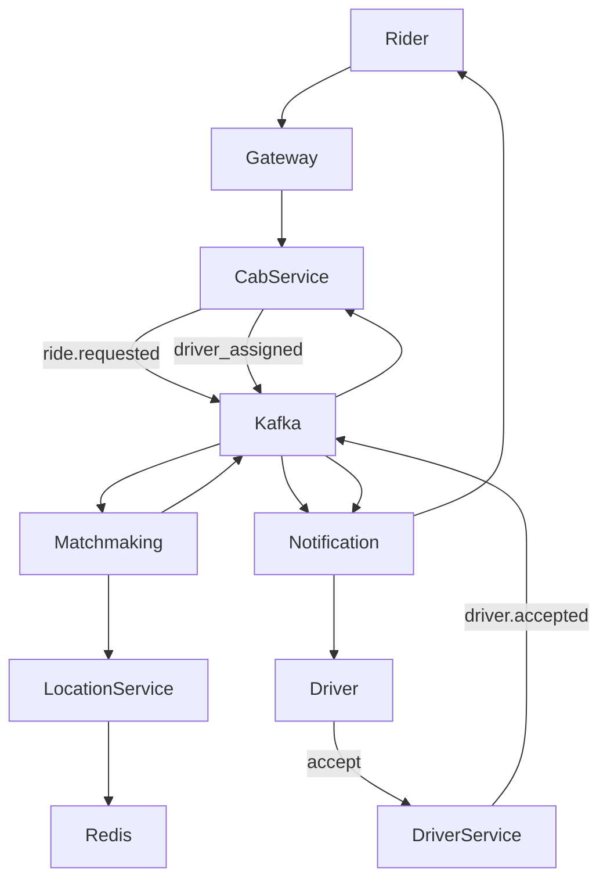

# 🚗 Smart Mobility Platform

## 📌 Overview

A production-grade, event-driven ride-hailing platform designed for scalability, low latency matchmaking, and strong consistency in ride lifecycle.

---

# 📄 PRODUCT REQUIREMENTS DOCUMENT (PRD)

## 1. Product Vision

Build a scalable Smart Mobility system connecting riders and drivers with real-time matching, intelligent pricing, and high availability.

---

## 2. Objectives

### Primary

* Real-time ride booking and driver allocation
* Matchmaking latency < 2 seconds
* Strong ride lifecycle consistency

### Secondary

* Dynamic pricing
* Driver optimization
* Observability-first architecture

---

## 3. Personas

### Rider

* Book rides
* Track trips
* Make payments

### Driver

* Accept/reject rides
* Update availability
* Earn income

---

## 4. Core Features

### Authentication

* JWT-based auth
* Role-based access

### Ride Booking

* Create ride
* Driver assignment
* Lifecycle tracking

### Matchmaking

* Nearby driver discovery
* Ranking algorithm
* Retry logic

### Driver Management

* Availability
* Location updates

---

## 5. Ride Lifecycle

REQUESTED → MATCHED → ACCEPTED → STARTED → COMPLETED → CANCELLED

---

## 6. Non-Functional Requirements

* High scalability (horizontal)
* 99.9% availability
* API latency < 200ms
* Event-driven consistency

---

# 🏗️ HIGH LEVEL DESIGN (HLD)

## Service Ports

| Service | Port | Technology |
|---------|------|------------|
| Gateway | 8080 | Spring Cloud Gateway |
| Auth Service | 8082 | Spring Boot |
| User Service | 8081 | Spring Boot |
| Cab Service | 8083 | Spring Boot |
| Driver Service | 8084 | Spring Boot |
| Location Service | 8086 | Spring Boot + Redis |
| Matchmaking Service | 8087 | Spring Boot + Kafka |
| Realtime Gateway | 8085 | Spring Boot + WebSocket |
| PostgreSQL | 5432 | - |
| Redis | 6379 | - |
| Kafka | 9092 | - |

## Architecture Overview

Client → API Gateway → Microservices → Kafka → DB/Cache/Redis

---

## Diagram
#### COMPONENT DIAGRAM (HLD VIEW)

## Component Diagrams

#### SYSTEM FLOW (SEQUENCE)

#### RIDE STATE MACHINE

#### DRIVER STATE MACHINE

#### END-TO-END FLOW (SIMPLIFIED)

# 🧩 SERVICES & RESPONSIBILITIES

## 1. API Gateway

### Responsibilities

* Request routing
* JWT Authentication validation
* Role-based authorization (ADMIN, DRIVER, RIDER)
* Rate limiting (Redis)
* Circuit breaker (Resilience4j)

### Communication

* Sync → All services

### Routes

| Path | Service | Port | Roles Allowed |
|------|---------|------|---------------|
| /auth/** | auth-service | 8082 | ADMIN |
| /users/** | user-service | 8081 | ADMIN, RIDER |
| /rides/** | cab-service | 8083 | ADMIN, RIDER |
| /dispatch/** | cab-service | 8083 | ADMIN, RIDER, DRIVER | ← Driver response moved here |
| /driver/** | driver-service | 8084 | ADMIN, DRIVER |
| /location/driver/online | location-service | 8086 | ADMIN, DRIVER |
| /location/driver/offline | location-service | 8086 | ADMIN, DRIVER |
| /location/driver/update | location-service | 8086 | ADMIN, DRIVER |
| /internal/** | matchmaking-service, location-service | 8087, 8086 | INTERNAL ONLY |
| /ws/** | realtime-gateway-service | 8085 | RIDER, DRIVER (WebSocket) |

---

## 2. Auth Service

### Responsibilities

* Login/Register
* JWT issuance
* Credential storage

### Communication

* Emits → user.created (Kafka)

---

## 3. User Service

### Responsibilities

* User profile management
* Role management

### Communication

* Consumes → user.created
* Sync APIs for reads

---

## 4. Cab Service (CORE - Orchestrator)

### Responsibilities

* Ride creation & state machine
* Persist rides
* **Dispatch APIs** - Handle driver response, cancel, status queries
* Publish driver response events to Kafka

### Communication

* Emits → ride-requested, assignment-accepted, assignment-rejected
* Consumes → driver-assigned, matchmaking-failed

---

## 5. Driver Service

### Responsibilities

* Driver onboarding
* Availability tracking
* Location updates

### Communication

* Sync → Matchmaking
* Emits → driver actions (accept/reject)

---

## 6. Matchmaking Service (CORE INTELLIGENCE - INTERNAL)

### Responsibilities

* Find nearby drivers via Location Service
* Rank drivers
* Assign driver (via Driver Service)
* Handle retry on driver rejection

### Communication

* Consumes → ride-requested, assignment-rejected
* Calls → Location Service, Driver Service
* Emits → driver-assigned, matchmaking-failed

> ⚠️ **No user-facing APIs** - triggered via Kafka events only

---

## 7. Location Service

### Responsibilities

* Real-time driver location (Redis GEO)
* Driver availability tracking
* Nearby driver queries for matchmaking

### Communication

* Sync → Matchmaking Service
* Redis for spatial data
* Emits → driver-location-events (Kafka)

---

## 8. Realtime Gateway Service

### Responsibilities

* Event fanout via WebSocket/STOMP
* Rider trip tracking (driver location broadcasts)
* Driver assignment notifications
* Stateless, no persistence

### Communication

* Consumes → driver-location-events, assignment-requested (Kafka)
* WebSocket → Rider App, Driver App

---

## 9. Pricing Service (Future)

### Responsibilities

* Fare calculation
* Surge pricing

---

## 9. Payment Service (Future)

### Responsibilities

* Payment processing

---

# 🔗 INTER-SERVICE COMMUNICATION

## Synchronous (REST)

* Gateway → Services
* Matchmaking → Driver

## Asynchronous (Kafka)

### Topics

| Topic | Producer | Consumer | Purpose |
|-------|----------|----------|---------|
| ride-requested | Cab Service | Matchmaking | Trigger driver matching |
| driver-assigned | Matchmaking | Cab Service | Driver successfully assigned |
| matchmaking-failed | Matchmaking | Cab Service | No driver available |
| assignment-accepted | Cab Service | Matchmaking | Driver accepted (from /dispatch/driver-response) |
| assignment-rejected | Cab Service | Matchmaking | Driver rejected → retry |
| driver-location-events | Location Service | Realtime Gateway | Driver location updates for rider tracking |
| assignment-requested | Matchmaking Service | Realtime Gateway | Driver assignment notifications |

Legacy/Other:
* user.created
* user.create.requested
* driver.status.updated

### Key Flows

**Ride Booking Flow:**
1. Cab Service → ride-requested → Kafka
2. Matchmaking consumes ride-requested
3. Matchmaking → Location Service (nearby drivers)
4. Matchmaking → Driver Service (driver details)
5. Matchmaking selects best driver
6. Matchmaking → Driver Service (mark unavailable)
7. Matchmaking → driver-assigned → Kafka
8. Cab Service consumes driver-assigned

### Flow

1. Ride Service emits ride.requested
2. Matchmaking consumes
3. Driver assigned
4. ride.matched emitted
5. Ride updated

---

# 🧠 DESIGN PATTERNS USED

## 1. Microservices Architecture

* Independent services

## 2. API Gateway Pattern

* Central entry point

## 3. Saga Pattern (Kafka)

* Distributed consistency

## 4. Event-Driven Architecture

* Loose coupling via Kafka

## 5. State Machine Pattern

* Ride lifecycle enforcement

## 6. Circuit Breaker

* Resilience (Resilience4j)

## 7. Retry Pattern

* Fault tolerance

## 8. Caching Pattern (Redis)

* Fast driver lookup

## 9. CQRS (Future)

* Separate read/write paths

## 10. Role-Based Access Control (Gateway)

* JWT contains user roles
* Gateway validates role vs requested path
* Services trust X-User-Id headers from gateway

### Roles & Permissions

| Role | Access Paths |
|------|---------------|
| ADMIN | All paths |
| DRIVER | /driver/**, /location/**, /matchmaking/** |
| RIDER | /users/**, /cab/**, /matchmaking/** |

---

# 🗄️ DATA LAYER

## PostgreSQL

* Strong consistency
* Ride & user data

## Redis

* Driver location (Geo)
* Availability cache
* Rate limiting

---

# 📊 OBSERVABILITY (Planned)

* Prometheus (metrics)
* Grafana (dashboards)
* OpenTelemetry (tracing)

---

# 🚀 DEPLOYMENT

* Docker (current)
* Kubernetes (future)

---

# 📌 KEY ARCHITECTURAL DECISIONS

1. Kafka-first async design → scalability
2. Ride Service as source of truth → consistency
3. Matchmaking isolated → independent scaling
4. Redis for real-time ops → low latency

---

# 🧭 WHY THIS DESIGN

* Prevents tight coupling
* Handles high concurrency
* Enables independent scaling
* Supports future extensions (delivery, logistics)

---

**Status:** Actively under development (microservice-by-microservice build)

---

