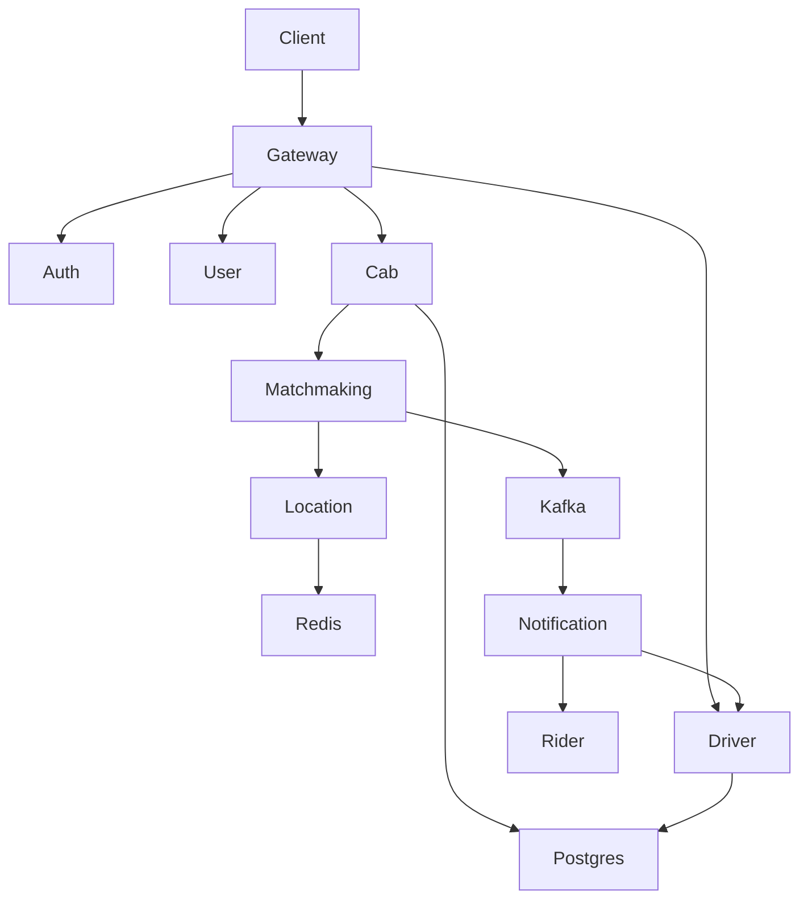
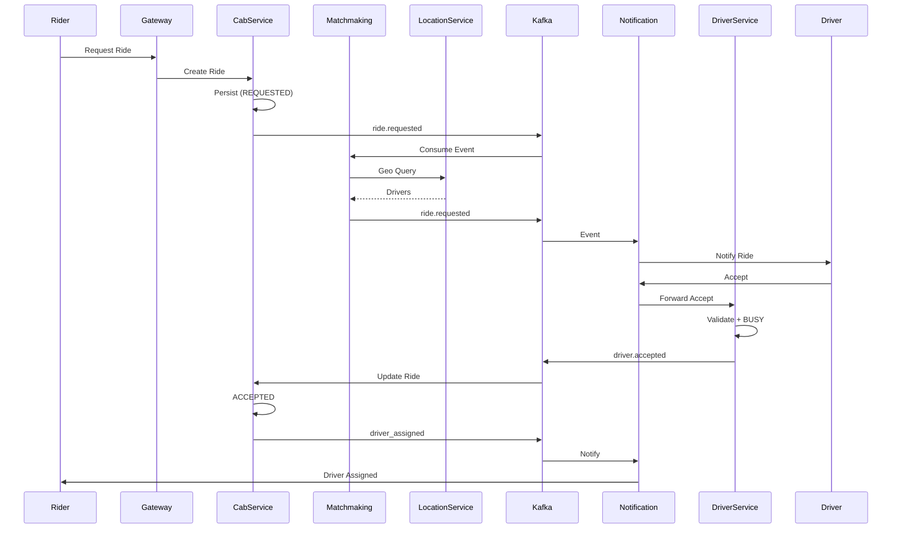
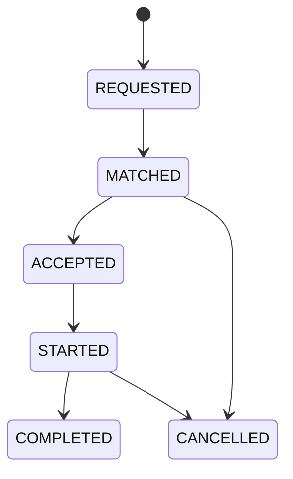
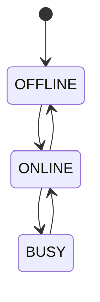
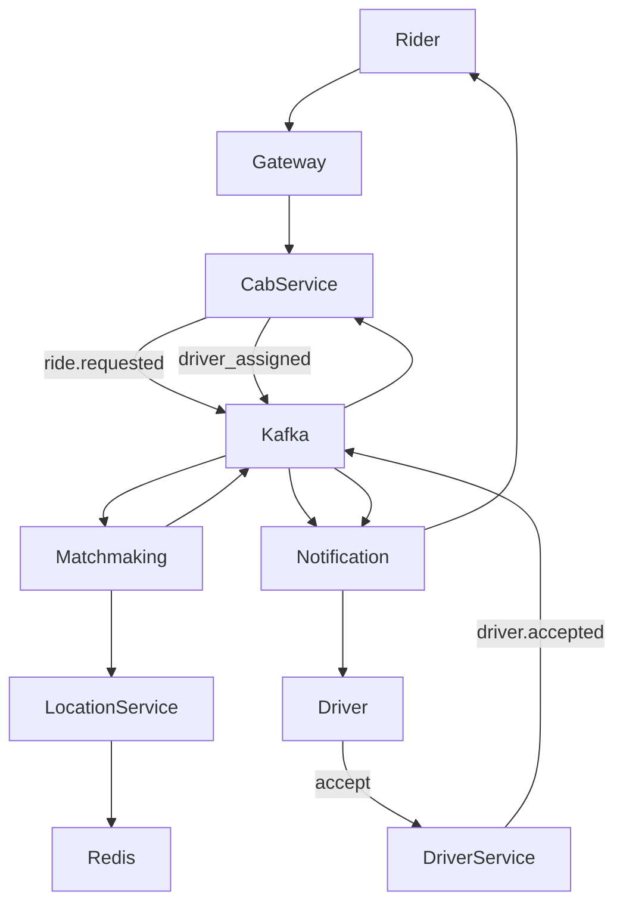

# 🚗 Smart Mobility Platform

## 📌 Overview

A production-grade, event-driven ride-hailing platform designed for scalability, low latency matchmaking, and strong consistency in ride lifecycle.

---

# 📄 PRODUCT REQUIREMENTS DOCUMENT (PRD)

## 1. Product Vision

Build a scalable Smart Mobility system connecting riders and drivers with real-time matching, intelligent pricing, and high availability.

---

## 2. Objectives

### Primary

* Real-time ride booking and driver allocation
* Matchmaking latency < 2 seconds
* Strong ride lifecycle consistency

### Secondary

* Dynamic pricing
* Driver optimization
* Observability-first architecture

---

## 3. Personas

### Rider

* Book rides
* Track trips
* Make payments

### Driver

* Accept/reject rides
* Update availability
* Earn income

---

## 4. Core Features

### Authentication

* JWT-based auth
* Role-based access

### Ride Booking

* Create ride
* Driver assignment
* Lifecycle tracking

### Matchmaking

* Nearby driver discovery
* Ranking algorithm
* Retry logic

### Driver Management

* Availability
* Location updates

---

## 5. Ride Lifecycle

REQUESTED → MATCHED → ACCEPTED → STARTED → COMPLETED → CANCELLED

---

## 6. Non-Functional Requirements

* High scalability (horizontal)
* 99.9% availability
* API latency < 200ms
* Event-driven consistency

---

# 🏗️ HIGH LEVEL DESIGN (HLD)

## Architecture Overview

Client → API Gateway → Microservices → Kafka → DB/Cache

---

## Diagram
#### COMPONENT DIAGRAM (HLD VIEW)

## Component Diagrams

#### SYSTEM FLOW (SEQUENCE)

#### RIDE STATE MACHINE

#### DRIVER STATE MACHINE

#### END-TO-END FLOW (SIMPLIFIED)

# 🧩 SERVICES & RESPONSIBILITIES

## 1. API Gateway

### Responsibilities

* Request routing
* Authentication validation
* Rate limiting (Redis)

### Communication

* Sync → All services

---

## 2. Auth Service

### Responsibilities

* Login/Register
* JWT issuance
* Credential storage

### Communication

* Emits → user.created (Kafka)

---

## 3. User Service

### Responsibilities

* User profile management
* Role management

### Communication

* Consumes → user.created
* Sync APIs for reads

---

## 4. Ride Service (CORE)

### Responsibilities

* Ride creation
* Ride state machine
* Persist rides

### Communication

* Emits → ride.requested
* Consumes → ride.matched, ride.accepted

---

## 5. Driver Service

### Responsibilities

* Driver onboarding
* Availability tracking
* Location updates

### Communication

* Sync → Matchmaking
* Emits → driver actions (accept/reject)

---

## 6. Matchmaking Service (CORE INTELLIGENCE)

### Responsibilities

* Find nearby drivers
* Rank drivers
* Assign driver

### Communication

* Consumes → ride.requested
* Calls → Driver Service
* Emits → ride.matched

---

## 7. Notification Service (Future)

### Responsibilities

* Push notifications

### Communication

* Consumes ride events

---

## 8. Pricing Service (Future)

### Responsibilities

* Fare calculation
* Surge pricing

---

## 9. Payment Service (Future)

### Responsibilities

* Payment processing

---

# 🔗 INTER-SERVICE COMMUNICATION

## Synchronous (REST)

* Gateway → Services
* Matchmaking → Driver

## Asynchronous (Kafka)

### Topics

* user.created
* ride.requested
* ride.matched
* ride.accepted
* ride.completed

### Flow

1. Ride Service emits ride.requested
2. Matchmaking consumes
3. Driver assigned
4. ride.matched emitted
5. Ride updated

---

# 🧠 DESIGN PATTERNS USED

## 1. Microservices Architecture

* Independent services

## 2. API Gateway Pattern

* Central entry point

## 3. Saga Pattern (Kafka)

* Distributed consistency

## 4. Event-Driven Architecture

* Loose coupling via Kafka

## 5. State Machine Pattern

* Ride lifecycle enforcement

## 6. Circuit Breaker

* Resilience (Resilience4j)

## 7. Retry Pattern

* Fault tolerance

## 8. Caching Pattern (Redis)

* Fast driver lookup

## 9. CQRS (Future)

* Separate read/write paths

---

# 🗄️ DATA LAYER

## PostgreSQL

* Strong consistency
* Ride & user data

## Redis

* Driver location (Geo)
* Availability cache
* Rate limiting

---

# 📊 OBSERVABILITY (Planned)

* Prometheus (metrics)
* Grafana (dashboards)
* OpenTelemetry (tracing)

---

# 🚀 DEPLOYMENT

* Docker (current)
* Kubernetes (future)

---

# 📌 KEY ARCHITECTURAL DECISIONS

1. Kafka-first async design → scalability
2. Ride Service as source of truth → consistency
3. Matchmaking isolated → independent scaling
4. Redis for real-time ops → low latency

---

# 🧭 WHY THIS DESIGN

* Prevents tight coupling
* Handles high concurrency
* Enables independent scaling
* Supports future extensions (delivery, logistics)

---

**Status:** Actively under development (microservice-by-microservice build)

---

