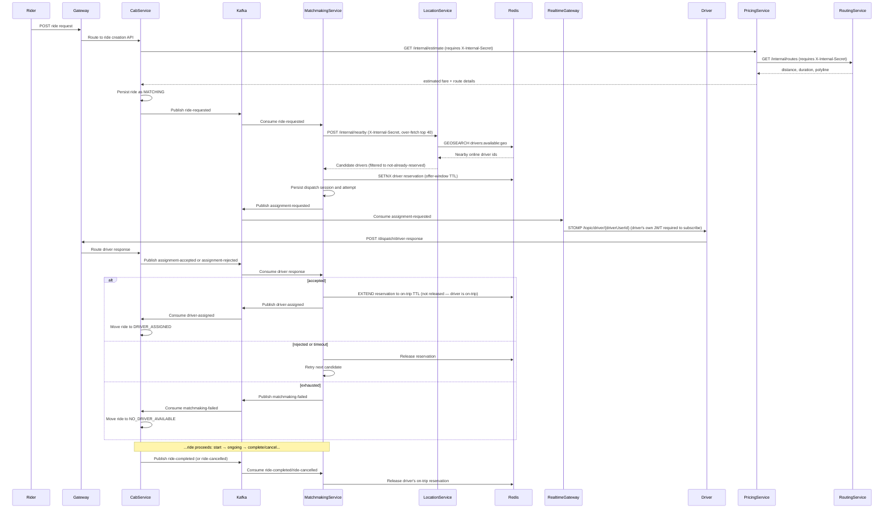
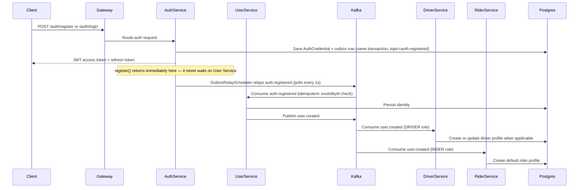
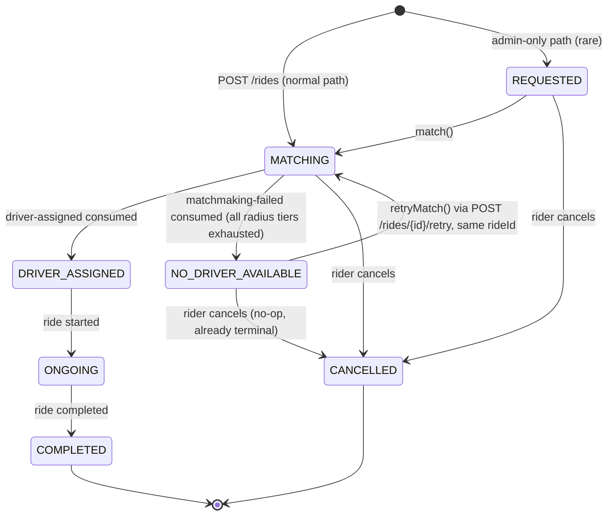
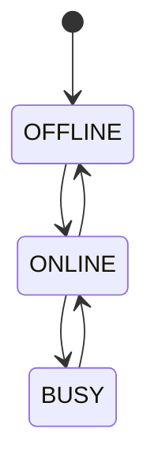
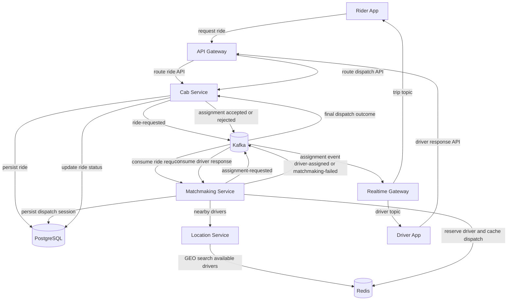

# 🚗 Smart Mobility Platform

## 📌 Overview

A production-grade, event-driven ride-hailing platform designed for scalability, low latency matchmaking, and strong consistency in ride lifecycle.

---

# 📄 PRODUCT REQUIREMENTS DOCUMENT (PRD)

## 1. Product Vision

Build a scalable Smart Mobility system connecting riders and drivers with real-time matching, intelligent pricing, and high availability.

---

## 2. Objectives

### Primary

* Real-time ride booking and driver allocation
* Matchmaking latency < 2 seconds
* Strong ride lifecycle consistency

### Secondary

* Dynamic pricing
* Driver optimization
* Observability-first architecture

---

## 3. Personas

### Rider

* Book rides
* Track trips
* Make payments

### Driver

* Accept/reject rides
* Update availability
* Earn income

---

## 4. Core Features

### Authentication

* JWT-based auth
* Role-based access

### Ride Booking

* Create ride
* Driver assignment
* Lifecycle tracking

### Matchmaking

* Nearby driver discovery
* Ranking algorithm
* Retry logic

### Driver Management

* Availability
* Location updates

---

## 5. Ride Lifecycle

REQUESTED → MATCHING → DRIVER_ASSIGNED → ONGOING → COMPLETED

Terminal/alternate states: CANCELLED, NO_DRIVER_AVAILABLE

---

## 6. Non-Functional Requirements

* High scalability (horizontal)
* 99.9% availability
* API latency < 200ms
* Event-driven consistency

---

# 🏗️ HIGH LEVEL DESIGN (HLD)

## Service Ports

| Service | Port | Technology |
|---------|------|------------|
| Gateway | 8080 | Spring Cloud Gateway |
| Auth Service | 8091 | Spring Boot |
| User Service | 8081 | Spring Boot |
| Cab Service | 8089 | Spring Boot |
| Driver Service | 8084 | Spring Boot |
| Rider Service | 8082 | Spring Boot |
| Location Service | 8090 | Spring Boot + Redis |
| Matchmaking Service | 8087 | Spring Boot + Kafka |
| Realtime Gateway | 8095 | Spring Boot + WebSocket |
| Notification Service | 8096 | Spring Boot + Postgres |
| Routing Service | 8097 | Spring Boot + Redis |
| Pricing Service | 8092 | Spring Boot + Redis |
| Payment Service | 8093 | Spring Boot |
| Eureka (peer1) | 8761 | Spring Boot |
| Eureka (peer2) | 8762 | Spring Boot |
| PostgreSQL | 5432 | - |
| Redis | 6379 | - |
| Kafka | 9092 | - |
| Zipkin | 9411 | Distributed tracing UI |

> **Eureka is now HA** (`eureka-service` + `eureka-service-2`, registered as peers) instead of a single
> instance — a single Eureka node was a full-system service-discovery SPOF. Peer-awareness is env-driven
> (`EUREKA_REGISTER_WITH_EUREKA`, `EUREKA_FETCH_REGISTRY`, `EUREKA_PEER_ZONE`), defaulting to standalone
> behavior for plain local `mvn spring-boot:run`. Every client's `EUREKA_URL` lists both peer zone URLs
> (comma-separated) for failover.

## Architecture Overview

Client → API Gateway → Microservices → Kafka + DB/Cache/Redis → WebSocket fanout

---

## Diagram
#### COMPONENT DIAGRAM (HLD VIEW)

```mermaid
flowchart TD

RiderApp["Rider App"] -->|"REST"| Gateway["API Gateway :8080"]
DriverApp["Driver App"] -->|"REST"| Gateway
RiderApp -->|"STOMP subscribe"| Realtime["Realtime Gateway :8095"]
DriverApp -->|"STOMP subscribe"| Realtime

Gateway -->|"auth routes"| Auth["Auth Service :8091"]
Gateway -->|"user routes"| User["User Service :8081"]
Gateway -->|"rides and dispatch routes"| Cab["Cab Service :8089"]
Gateway -->|"driver routes"| Driver["Driver Service :8084"]
Gateway -->|"rider routes"| Rider["Rider Service :8082"]
Gateway -->|"location driver routes"| Location["Location Service :8090"]
Gateway -->|"matchmaking routes"| Matchmaking["Matchmaking Service :8087"]
Gateway -->|"pricing routes"| Pricing["Pricing Service :8092"]
Gateway -->|"payment routes"| Payment["Payment Service :8093"]
Gateway -->|"routing routes"| Routing["Routing Service :8097"]

Auth -->|"auth.registered (outbox → Kafka)"| Kafka[("Kafka :9092")]
Kafka -->|"auth.registered"| User
User -->|"user.created"| Kafka
Kafka -->|"user.created"| Driver
Kafka -->|"user.created"| Rider
Auth -->|"lookup only: findByEmail / findByUserId"| User

Cab -->|"ride-requested"| Kafka
Kafka -->|"ride-requested"| Matchmaking
Matchmaking -->|"nearby drivers API"| Location
Location -->|"GEO and availability"| Redis[("Redis :6379")]
Matchmaking -->|"driver reservation and dispatch cache"| Redis
Matchmaking -->|"dispatch sessions and attempts"| Postgres[("PostgreSQL :5432")]
Cab -->|"rides"| Postgres
Auth -->|"credentials and refresh tokens"| Postgres
User -->|"users"| Postgres
Driver -->|"drivers"| Postgres
Rider -->|"riders"| Postgres

Matchmaking -->|"driver-assigned or matchmaking-failed"| Kafka
Kafka -->|"driver-assigned or matchmaking-failed"| Cab
Cab -->|"assignment-accepted or assignment-rejected"| Kafka
Kafka -->|"assignment response"| Matchmaking

Matchmaking -->|"assignment-requested"| Kafka
Kafka -->|"driver-location-events or assignment-requested"| Realtime
Realtime -->|"trip topic"| RiderApp
Realtime -->|"driver topic"| DriverApp

Kafka -->|"domain events"| Notification["Notification Service :8096"]
Notification -->|"delivery records"| Postgres

Gateway -.->|"service discovery"| Eureka["Eureka :8761"]
Auth -.->|"registers"| Eureka
User -.->|"registers"| Eureka
Cab -.->|"registers"| Eureka
Driver -.->|"registers"| Eureka
Rider -.->|"registers"| Eureka
Location -.->|"registers"| Eureka
Matchmaking -.->|"registers"| Eureka
Realtime -.->|"registers"| Eureka
Notification -.->|"registers"| Eureka
Pricing -.->|"registers"| Eureka
Payment -.->|"registers"| Eureka
Routing -.->|"registers"| Eureka
```

## Component Diagrams

#### SYSTEM FLOW (SEQUENCE)

```mermaid
sequenceDiagram
    participant Rider
    participant Gateway
    participant CabService
    participant Kafka
    participant MatchmakingService
    participant LocationService
    participant Redis
    participant RealtimeGateway
    participant Driver
    participant PricingService
    participant RoutingService

    Rider->>Gateway: POST ride request
    Gateway->>CabService: Route to ride creation API
    CabService->>PricingService: GET /internal/estimate (requires X-Internal-Secret)
    PricingService->>RoutingService: GET /internal/routes (requires X-Internal-Secret)
    RoutingService-->>PricingService: distance, duration, polyline
    PricingService-->>CabService: estimated fare + route details
    CabService->>CabService: Persist ride as MATCHING
    CabService->>Kafka: Publish ride-requested

    Kafka->>MatchmakingService: Consume ride-requested
    MatchmakingService->>LocationService: POST /internal/nearby (X-Internal-Secret, over-fetch top 40)
    LocationService->>Redis: GEOSEARCH drivers:available:geo
    Redis-->>LocationService: Nearby online driver ids
    LocationService-->>MatchmakingService: Candidate drivers (filtered to not-already-reserved)

    MatchmakingService->>Redis: SETNX driver reservation (offer-window TTL)
    MatchmakingService->>MatchmakingService: Persist dispatch session and attempt
    MatchmakingService->>Kafka: Publish assignment-requested

    Kafka->>RealtimeGateway: Consume assignment-requested
    RealtimeGateway->>Driver: STOMP /topic/driver/{driverUserId} (driver's own JWT required to subscribe)

    Driver->>Gateway: POST /dispatch/driver-response
    Gateway->>CabService: Route driver response
    CabService->>Kafka: Publish assignment-accepted or assignment-rejected

    Kafka->>MatchmakingService: Consume driver response
    alt accepted
        MatchmakingService->>Redis: EXTEND reservation to on-trip TTL (not released — driver is on-trip)
        MatchmakingService->>Kafka: Publish driver-assigned
        Kafka->>CabService: Consume driver-assigned
        CabService->>CabService: Move ride to DRIVER_ASSIGNED
    else rejected or timeout
        MatchmakingService->>Redis: Release reservation
        MatchmakingService->>MatchmakingService: Retry next candidate
    else exhausted
        MatchmakingService->>Kafka: Publish matchmaking-failed
        Kafka->>CabService: Consume matchmaking-failed
        CabService->>CabService: Move ride to NO_DRIVER_AVAILABLE
    end

    Note over CabService,MatchmakingService: ...ride proceeds: start → ongoing → complete/cancel...
    CabService->>Kafka: Publish ride-completed (or ride-cancelled)
    Kafka->>MatchmakingService: Consume ride-completed/ride-cancelled
    MatchmakingService->>Redis: Release driver's on-trip reservation
```

#### AUTH + USER + ROLE-SPECIFIC ONBOARDING FLOW

```mermaid
sequenceDiagram
    participant Client
    participant Gateway
    participant AuthService
    participant UserService
    participant Kafka
    participant DriverService
    participant RiderService
    participant Postgres

    Client->>Gateway: POST /auth/register or /auth/login
    Gateway->>AuthService: Route auth request
    AuthService->>Postgres: Save AuthCredential + outbox row (same transaction, topic=auth.registered)
    AuthService-->>Client: JWT access token + refresh token
    Note over AuthService: register() returns immediately here — it never waits on User Service
    AuthService->>Kafka: OutboxRelayScheduler relays auth.registered (polls every 1s)
    Kafka->>UserService: Consume auth.registered (idempotent: existsById check)
    UserService->>Postgres: Persist identity
    UserService->>Kafka: Publish user.created
    Kafka->>DriverService: Consume user.created (DRIVER role)
    DriverService->>Postgres: Create or update driver profile when applicable
    Kafka->>RiderService: Consume user.created (RIDER role)
    RiderService->>Postgres: Create default rider profile
```
> No `/internal/users` REST call is made during registration — that Feign client
> (`UserServiceClient`) exists only for `findByEmail`/`findByUserId` lookups on the login/refresh path.
> User Service's own profile creation is entirely event-driven and happens **after** the client already
> has their JWT, not as a precondition for registration succeeding.

#### RIDE STATE MACHINE

`POST /rides` sets status directly to `MATCHING` (REQUESTED is only reached via a separate admin-only
`/rides/{id}/match` path, not normal ride creation). Matchmaking widens its search radius (5km, 10km, 15km)
before ever failing — ride stays `MATCHING` through that whole widen loop; see Matchmaking Service section
for the internal `DispatchStatus` sweep. Cancel is **rejected** once `DRIVER_ASSIGNED` (no way to back out
after a driver accepts, by current design — not modeled as a transition below because it doesn't exist).

```mermaid
stateDiagram-v2
    [*] --> MATCHING: POST /rides (normal path)
    [*] --> REQUESTED: admin-only path (rare)
    REQUESTED --> MATCHING: match()
    REQUESTED --> CANCELLED: rider cancels
    MATCHING --> DRIVER_ASSIGNED: driver-assigned consumed
    MATCHING --> NO_DRIVER_AVAILABLE: matchmaking-failed consumed (all radius tiers exhausted)
    MATCHING --> CANCELLED: rider cancels
    DRIVER_ASSIGNED --> ONGOING: ride started
    ONGOING --> COMPLETED: ride completed
    NO_DRIVER_AVAILABLE --> MATCHING: retryMatch() via POST /rides/{id}/retry, same rideId
    NO_DRIVER_AVAILABLE --> CANCELLED: rider cancels (no-op, already terminal)
    COMPLETED --> [*]
    CANCELLED --> [*]
```

#### DRIVER STATE MACHINE

```mermaid
stateDiagram-v2
    [*] --> OFFLINE
    OFFLINE --> ONLINE
    ONLINE --> BUSY
    BUSY --> ONLINE
    ONLINE --> OFFLINE
```

#### END-TO-END FLOW (SIMPLIFIED)

```mermaid
flowchart TD

Rider["Rider App"] -->|"request ride"| Gateway["API Gateway"]
Gateway -->|"route ride API"| CabService["Cab Service"]

CabService -->|"persist ride"| Postgres[("PostgreSQL")]
CabService -->|"ride-requested"| Kafka[("Kafka")]
Kafka -->|"consume ride request"| Matchmaking["Matchmaking Service"]

Matchmaking -->|"nearby drivers"| LocationService["Location Service"]
LocationService -->|"GEO search available drivers"| Redis[("Redis")]
Matchmaking -->|"reserve driver and cache dispatch"| Redis
Matchmaking -->|"persist dispatch session"| Postgres

Matchmaking -->|"assignment-requested"| Kafka
Kafka -->|"assignment event"| RealtimeGateway["Realtime Gateway"]
RealtimeGateway -->|"driver topic"| Driver["Driver App"]

Driver -->|"driver response API"| Gateway
Gateway -->|"route dispatch API"| CabService
CabService -->|"assignment accepted or rejected"| Kafka
Kafka -->|"consume driver response"| Matchmaking

Matchmaking -->|"driver-assigned or matchmaking-failed"| Kafka
Kafka -->|"final dispatch outcome"| CabService
CabService -->|"update ride status"| Postgres
RealtimeGateway -->|"trip topic"| Rider
```
# 🧩 SERVICES & RESPONSIBILITIES

## 1. API Gateway

### Responsibilities

* Request routing
* JWT Authentication validation
* Role-based authorization (ADMIN, DRIVER, RIDER)
* Rate limiting (Redis)
* Circuit breaker (Resilience4j)

### Communication

* Sync → All services

### Routes

| Path | Service | Port | Roles Allowed |
|------|---------|------|---------------|
| /auth/** | auth-service | 8091 | Public auth APIs |
| /users/** | user-service | 8081 | Configured gateway route |
| /cab/**, /rides/**, /dispatch/** | cab-service | 8089 | Cab and ride APIs |
| /driver/**, /drivers/** | driver-service | 8084 | Driver APIs |
| /riders/** | rider-service | 8082 | RIDER, ADMIN |
| /location/driver/online | location-service | 8090 | DRIVER |
| /location/driver/offline | location-service | 8090 | DRIVER |
| /location/driver/update | location-service | 8090 | DRIVER |
| /internal/nearby | location-service | 8090 | Blocked at gateway edge, **and** now verified by location-service itself via `X-Internal-Secret` |
| /matchmaking/** | matchmaking-service | 8087 | Configured gateway route |

> **Internal API auth hardened:** the gateway's path-block on `/internal/**` used to be the *only*
> protection — any pod with direct network access to user-service, location-service, or matchmaking-service
> could call their internal endpoints unauthenticated. Each of those services now runs an
> `InternalApiSecurityFilter` that checks an `X-Internal-Secret` header (shared secret, `internal.api.secret`)
> on every `/internal/**` request regardless of how it arrived. Callers (auth-service → user-service via a
> Feign `RequestInterceptor`; matchmaking-service → location-service; cab-service → matchmaking-service)
> attach the header on their outbound calls.

### Service Controller Paths

| Service | Controller Paths |
|---------|------------------|
| Auth Service | `/auth/register`, `/auth/login`, `/auth/refresh`, `/auth/logout`, `/auth/logout-all` |
| User Service | `/internal/users`, `/internal/users/{id}` |
| Cab Service | `/rides`, `/rides/{rideId}`, `/rides/{rideId}/cancel`, `/rides/{rideId}/start`, `/rides/{rideId}/complete`, `/dispatch/driver-response`, `/dispatch/cancel`, `/dispatch/{rideId}` |
| Driver Service | `/drivers`, `/drivers/{userId}` |
| Rider Service | `/riders/me`, `/riders/me/preferences`, `/riders/me/locations`, `/riders/me/locations/{locationId}` |
| Location Service | `/location/driver/online`, `/location/driver/offline`, `/location/driver/update`, `/internal/nearby` |
| Matchmaking Service | `/internal/dispatch/{rideId}` |
| Realtime Gateway | `/realtime/info`, WebSocket/STOMP topics `/topic/trip/{rideId}` and `/topic/driver/{driverUserId}` |

---

## 2. Auth Service

### Responsibilities

* Login/Register — owns and commits the credential record directly; never blocks on User Service
* JWT issuance
* Credential storage (refresh tokens hashed at rest)

### Communication

* Calls → User Service `/internal/users` — **lookup only** (`findByEmail`/`findByUserId` on login/refresh),
  never to create a user
* Emits → `auth.registered` (via outbox) — the actual registration handoff to User Service
* Persists → auth credentials, refresh tokens

---

## 3. User Service

### Responsibilities

* User profile management
* Role management

### Communication

* Consumes → `auth.registered` (from Auth Service, via outbox) — idempotent, creates the identity record
* Emits → user.created
* Sync APIs for reads

---

## 4. Cab Service (CORE - Orchestrator)

### Responsibilities

* Ride creation & state machine
* Persist rides
* **Dispatch APIs** - Handle driver response, cancel, status queries
* Publish driver response events to Kafka

### Communication

* Emits → ride-requested, assignment-accepted, assignment-rejected
* Consumes → driver-assigned, matchmaking-failed

---

## 5. Driver Service

### Responsibilities

* Driver onboarding
* Driver profile lookup
* Driver metadata persistence

### Communication

* Consumes → user.created
* Persists → driver profile data

---

## 6. Rider Service

### Responsibilities

* Rider profile onboarding and lifecycle management
* Saved locations management with geographic coordinates
* Role-based preference updates (e.g. payment method)
* Maintain overall rider rating

### Communication

* Consumes → user.created
* Persists → rider profiles and saved locations in `rider_db`
* Exposes REST APIs under `/riders/**` prefix

---

## 7. Matchmaking Service (CORE INTELLIGENCE - INTERNAL)

### Responsibilities

* Find nearby drivers via Location Service
* Rank drivers
* Reserve drivers using Redis TTL locks
* Coordinate assignment accepted/rejected events
* Handle retry on driver rejection or timeout

### Communication

* Consumes → ride-requested, assignment-accepted, assignment-rejected
* Calls → Location Service `/internal/nearby`
* Persists → dispatch sessions, assignment attempts, processed events
* Redis → driver reservations and dispatch cache
* Emits → driver-assigned, matchmaking-failed, assignment-requested

> ⚠️ **No user-facing APIs** - triggered via Kafka events only

---

## 8. Location Service

### Responsibilities

* Real-time driver location (Redis GEO)
* Driver availability tracking
* Nearby driver queries for matchmaking

### Communication

* Sync → Matchmaking Service
* Redis for spatial data
* Realtime integration topic → driver-location-events

---

## 9. Realtime Gateway Service

### Responsibilities

* Event fanout via WebSocket/STOMP
* Rider trip tracking (driver location broadcasts)
* Driver assignment notifications
* Stateless, no persistence

### Communication

* Consumes → driver-location-events, assignment-requested (Kafka)
* WebSocket → Rider App, Driver App

---

---

## 10. Notification Service

### Responsibilities

* Centralized outbound messaging (push/sms/email stubs)
* Persistence of notification delivery records
* Idempotency handling for domain events

### Communication

* Consumes → `ride-requested`, `driver-assigned`, `matchmaking-failed`, `ride-cancelled`, `ride-completed`, `assignment-requested`
* Database → `notification_db`

---

## 11. Pricing Service

### Responsibilities

* Upfront fare calculation
* Dynamic pricing (surge multipliers) based on supply/demand
* Promotions and discounts

### Communication

* REST (Inbound) ← `CabService` (for fare estimates)
* REST (Outbound) → `RoutingService` (for distance and time)
* Database → `pricing_db` (optional, if tracking receipts/promotions)

---

## 12. Payment Service

### Responsibilities

* Secure payment processing (Stripe/PayPal integration)
* Wallet management

### Communication

* REST (Inbound) ← `Gateway`, `CabService`

---

## 13. Routing Service

### Responsibilities

* Interfacing with 3rd party mapping providers (Google Maps, Mapbox, OSRM)
* Calculating distance, duration, and generating polylines
* Caching common routes in Redis to minimize API costs

### Communication

* REST (Inbound) ← `PricingService`, `Gateway`
* Outbound (HTTP) → Google Maps / Mapbox
* Cache → `Redis`

---

# 🔗 INTER-SERVICE COMMUNICATION

## Synchronous (REST)

* Gateway → Services
* Auth Service → User Service (`/internal/users`) — `X-Internal-Secret` header attached
* Matchmaking Service → Location Service (`/internal/nearby`) — `X-Internal-Secret` header attached
* Cab Service → Matchmaking Service (`/internal/dispatch/{rideId}`) — `X-Internal-Secret` header attached
* Realtime Gateway → Cab Service (`/rides/{rideId}`) — WebSocket trip-topic ownership check

## Asynchronous (Kafka)

### Topics

All topics below are declared explicitly via `NewTopic` beans (`KafkaTopicConfig` in the producing
service) — 3 partitions / replication factor 1 — instead of relying on broker auto-create defaults
(which would create single-partition topics, capping consumer-group parallelism at 1 instance).

| Topic | Producer | Consumer | Purpose |
|-------|----------|----------|---------|
| ride-requested | Cab Service | Matchmaking | Trigger driver matching |
| driver-assigned | Matchmaking | Cab Service | Driver successfully assigned |
| matchmaking-failed | Matchmaking | Cab Service | No driver available |
| assignment-accepted | Cab Service | Matchmaking | Driver accepted (from /dispatch/driver-response) |
| assignment-rejected | Cab Service | Matchmaking | Driver rejected → retry |
| driver-assignment-failed | Matchmaking | — | Driver-side assignment failure signal |
| driver-location-events | Location/event pipeline | Realtime Gateway | Driver location updates for rider tracking |
| assignment-requested | Matchmaking Service | Realtime Gateway | Driver assignment notifications |
| ride-completed | Cab Service | Matchmaking | Release driver's on-trip reservation |
| ride-cancelled | Cab Service | Matchmaking | Release driver's on-trip reservation (if a driver was assigned) |

Other:
* auth.registered (Auth Service → User Service, via outbox — registration handoff, not a saga)
* user.created (User Service → Driver Service, Rider Service)

### Key Flows

**Ride Booking Flow:**
1. Cab Service → ride-requested → Kafka
2. Matchmaking consumes ride-requested
3. Matchmaking → Location Service (nearby drivers, over-fetches top 40 by distance before eligibility filtering)
4. Location Service → Redis GEO (online available drivers)
5. Matchmaking reserves driver with Redis TTL lock (offer window)
6. Matchmaking → assignment-requested → Kafka
7. Realtime Gateway broadcasts to driver topic (WebSocket now requires the driver's own JWT to subscribe)
8. Driver → Cab Service `/dispatch/driver-response`
9. Cab Service → assignment-accepted or assignment-rejected → Kafka
10. Matchmaking publishes driver-assigned or matchmaking-failed; on acceptance the reservation is
    **extended** (on-trip TTL), not released
11. Cab Service consumes final outcome and updates ride state
12. When the ride later completes/cancels, Cab Service publishes ride-completed/ride-cancelled, which
    Matchmaking consumes to release the driver's reservation for real

**Auth/User/Role-Specific Onboarding Flow:**
1. Client → Gateway → Auth Service
2. Auth Service → User Service `/internal/users`
3. User Service persists identity
4. User Service → user.created → Kafka
5. Driver Service consumes user.created and creates/updates driver profile when applicable
6. Rider Service consumes user.created and creates/updates rider profile when applicable

**Realtime Flow:**
1. Realtime Gateway consumes driver-location-events and assignment-requested
2. Rider App subscribes to `/topic/trip/{rideId}`
3. Driver App subscribes to `/topic/driver/{driverUserId}`

---

# 🧠 DESIGN PATTERNS USED

## 1. Microservices Architecture

* Independent services

## 2. API Gateway Pattern

* Central entry point

## 3. Transactional Outbox Pattern (Kafka)

* Used by auth-service, cab-service — Kafka publish and the triggering DB write commit atomically in one
  transaction, relayed to Kafka by a polling scheduler. **Not a saga**: no compensation/rollback step
  exists anywhere in this system; downstream failures don't unwind the original write, they're just
  eventually-consistent

## 4. Event-Driven Architecture

* Loose coupling via Kafka

## 5. State Machine Pattern

* Ride lifecycle enforcement

## 6. Circuit Breaker

* Resilience (Resilience4j)

## 7. Retry Pattern

* Fault tolerance

## 8. Caching Pattern (Redis)

* Fast driver lookup

## 9. CQRS (Future)

* Separate read/write paths

## 10. Role-Based Access Control (Gateway)

* JWT contains user roles
* Gateway validates role vs requested path
* Services trust X-User-Id headers from gateway

### Roles & Permissions

| Role | Access Paths |
|------|---------------|
| ADMIN | All paths |
| DRIVER | Driver profile routes, location driver routes, dispatch driver response |
| RIDER | User routes, ride routes, dispatch status/cancel routes, rider profile and saved locations |
| INTERNAL SERVICE | Internal dispatch and nearby-driver lookup routes |

---

# 🗄️ DATA LAYER

## PostgreSQL

* Strong consistency
* `auth_db` for credentials and refresh tokens
* `user_db` for identity data
* `cab_db` for rides and processed events
* `driver_db` for driver profiles
* `rider_db` for rider profiles and saved locations
* `matchmaking_db` for dispatch sessions, assignment attempts, processed events

## Redis

* Gateway rate limiting
* Driver location GEO indexes
* Driver availability set
* Matchmaking driver reservations and dispatch cache

---

# 📊 OBSERVABILITY

* Prometheus (metrics)
* Grafana (dashboards)
* Distributed tracing: Micrometer Tracing + OpenTelemetry bridge (`micrometer-tracing-bridge-otel`) +
  Zipkin exporter, across all 9 app services (auth, user, cab, driver, location, matchmaking, gateway,
  realtime-gateway, rider). Trace/span IDs propagate across both HTTP and Kafka hops
  (`spring.kafka.template/listener.observation-enabled`); services with manually-built
  `ConcurrentKafkaListenerContainerFactory` beans (matchmaking, realtime-gateway, rider) set
  `factory.getContainerProperties().setObservationEnabled(true)` explicitly, since that property only
  auto-applies to Boot-auto-configured factories. Zipkin UI: `http://localhost:9411`.

---

# 🚀 DEPLOYMENT

* Docker Compose (current) — all app services and core infra (postgres, redis, kafka, zookeeper) carry
  explicit `mem_limit`/`cpus` and `healthcheck` (actuator `/health` for app services; `pg_isready`/
  `redis-cli ping` for infra) in the base `docker-compose.yml`, not just the load-test pressure overlay
* Kubernetes (future)

---

# 📌 KEY ARCHITECTURAL DECISIONS

1. Kafka-first async dispatch flow → scalability
2. Cab Service as ride source of truth → lifecycle consistency
3. Matchmaking isolated → independent scaling and retry control
4. Redis for real-time location and reservation state → low latency
5. Realtime Gateway stateless fanout → independent WebSocket scaling
6. Driver reservation lifecycle is event-driven end-to-end (reserve → extend on accept → release on
   ride-completed/cancelled), with TTL as a lost-event safety net rather than the primary release path →
   an accepted driver can no longer be double-booked while genuinely on-trip
7. Internal APIs authenticate themselves (`X-Internal-Secret`) rather than trusting the gateway's edge
   block or network position alone → each service is safe to call directly, not just via the gateway
8. WebSocket/STOMP auth is mandatory and session-scoped (JWT on CONNECT, topic ownership on SUBSCRIBE) →
   closes what was previously a fully open real-time channel
9. Eureka runs as an HA peer pair, not a single instance → removes a full-system discovery SPOF

---

# 🧭 WHY THIS DESIGN

* Prevents tight coupling
* Handles high concurrency
* Enables independent scaling
* Supports future extensions (delivery, logistics)

---

**Status:** Actively under development (microservice-by-microservice build)

---
