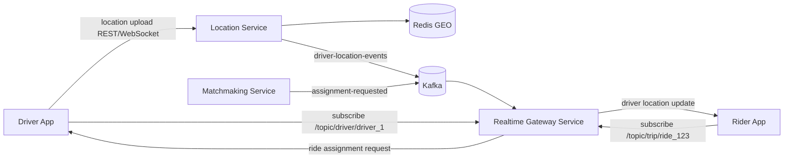
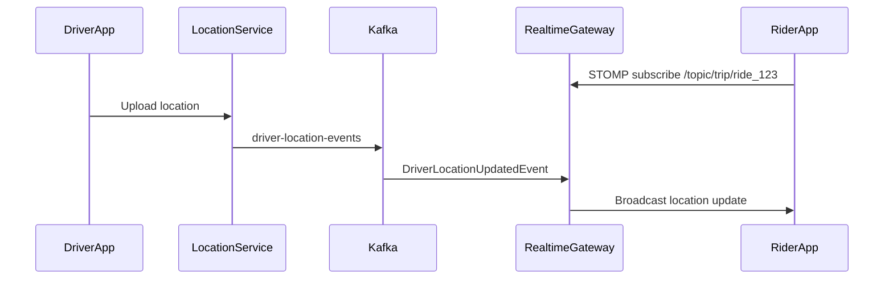
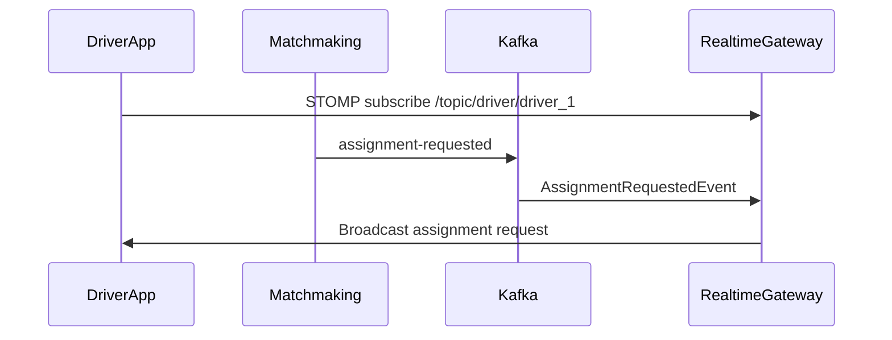

# Realtime Gateway Service Phase 1 - Design

## Summary

Build `realtime-gateway-service`, a stateless Spring Boot 3 service that bridges Kafka events to WebSocket/STOMP clients for the Smart Mobility platform.

Phase 1 supports two outbound realtime channels:

- Rider trip tracking: `driver-location-events` Kafka topic to `/topic/trip/{rideId}`
- Driver assignment notifications: `assignment-requested` Kafka topic to `/topic/driver/{driverId}`

The service runs on port `8085` and uses Java 21, Maven, Lombok, Spring WebSocket, STOMP, Spring SimpleBroker, and Spring Kafka.

## Architectural Boundary

Realtime Gateway is an event fanout service. It remains stateless and does not own domain state.

It does:

- Consume Kafka events.
- Validate that each event has the routing fields needed for fanout.
- Broadcast events to active WebSocket/STOMP subscribers.
- Log connection, subscription, disconnection, Kafka consumption, and broadcast failures.

It does not:

- Receive driver GPS uploads directly.
- Own ride state.
- Own driver state.
- Persist trip lifecycle or location history.
- Authenticate or authorize WebSocket clients in Phase 1.
- Implement Redis pub/sub, reconnect replay, sticky sessions, clustering, or distributed WebSocket routing.

Driver location ingestion remains the responsibility of Location Service. Driver assignment decisions remain the responsibility of Matchmaking Service.

## System Context



## Project Shape

The existing `realtime-gateway-service` module will be completed in place.

Configuration choices:

- Group: `com.mobility`
- Artifact: `realtime-gateway-service`
- Base package: `com.mobility.realtime`
- Port: `8085`
- Spring Boot: Spring Boot 3.x
- Java: 21
- Build: Maven

Package structure:

```text
com.mobility.realtime
├── config
├── websocket
├── kafka
├── service
├── dto
├── controller
├── handler
├── exception
├── util
└── domain
```

## WebSocket Design

Use STOMP over WebSocket with Spring SimpleBroker.

Configuration:

- WebSocket endpoint: `/ws`
- Application destination prefix: `/app`
- Broker destination prefix: `/topic`
- Allowed origins: all origins for Phase 1

Client subscriptions:

```text
Rider trip tracking:
  /topic/trip/{rideId}

Driver assignment notifications:
  /topic/driver/{driverId}
```

The service does not require clients to send application messages in Phase 1. `/app` is configured for future compatibility and conventional STOMP structure.

## Kafka Design

Kafka topics consumed by Realtime Gateway:

```text
driver-location-events
assignment-requested
```

Consumer group:

```text
realtime-gateway-service-group
```

The service should use JSON deserialization into typed DTOs. Invalid messages or messages missing routing fields are logged and routed through the configured Kafka error handling path rather than silently ignored.

## Event Contracts

### DriverLocationUpdatedEvent

Source: Location Service

Kafka topic:

```text
driver-location-events
```

Fields:

```text
driverId
rideId
latitude
longitude
speed
heading
timestamp
```

Sample:

```json
{
  "driverId": "driver_1",
  "rideId": "ride_123",
  "latitude": 28.6139,
  "longitude": 77.2090,
  "speed": 42.0,
  "heading": 120.0,
  "timestamp": "2026-05-17T12:00:00Z"
}
```

Broadcast destination:

```text
/topic/trip/{rideId}
```

### AssignmentRequestedEvent

Source: Matchmaking Service

Kafka topic:

```text
assignment-requested
```

Fields should match the existing matchmaking contract:

```text
eventId
eventType
dispatchId
rideId
driverId
pickupLatitude
pickupLongitude
pickupLocation
expiresAt
```

Broadcast destination:

```text
/topic/driver/{driverId}
```

Phase 1 only delivers the assignment request to the driver app. Driver accept or reject flows remain outside this service and continue through the existing cab or dispatch APIs and Kafka topics.

## Main Components

### WebSocketConfig

Responsibilities:

- Enable WebSocket message broker.
- Register `/ws` STOMP endpoint.
- Enable `/topic` simple broker.
- Set `/app` application destination prefix.
- Allow all origins for Phase 1.

### KafkaConsumerConfig

Responsibilities:

- Configure bootstrap servers from application config.
- Configure `realtime-gateway-service-group`.
- Configure JSON deserialization for typed events.
- Configure listener container factory.
- Configure bounded retry/backoff and error logging.

### DriverLocationConsumer

Responsibilities:

- Consume `driver-location-events`.
- Log event receipt with `rideId` and `driverId`.
- Validate `rideId` is present.
- Delegate to `RealtimeBroadcastService.broadcastDriverLocation`.

### DriverAssignmentConsumer

Responsibilities:

- Consume `assignment-requested`.
- Log event receipt with `driverId`, `rideId`, and `dispatchId`.
- Validate `driverId` is present.
- Delegate to `RealtimeBroadcastService.broadcastAssignmentRequest`.

### RealtimeBroadcastService

Responsibilities:

- Own WebSocket destination construction.
- Use `SimpMessagingTemplate` for STOMP broadcasts.
- Broadcast driver location events to `/topic/trip/{rideId}`.
- Broadcast assignment request events to `/topic/driver/{driverId}`.
- Log successful broadcasts at info or debug level with routing keys.

### WebSocketEventListener

Responsibilities:

- Listen for `SessionConnectEvent`.
- Listen for `SessionSubscribeEvent`.
- Listen for `SessionDisconnectEvent`.
- Log session id, destination when present, and connect/disconnect events.

### Controller Package

Phase 1 may include a lightweight health/info controller, but operational health should primarily use Spring Boot Actuator.

### Exception Package

Use focused runtime exceptions for invalid realtime routing payloads and central error handling for controller surfaces. Kafka listener exceptions should be visible in logs and handled by the Kafka error handler.

## Data Flow

### Rider Location Tracking



### Driver Assignment Notification



## Configuration

`application.yml` should include:

- `server.port: 8085`
- `spring.application.name: realtime-gateway-service`
- Kafka bootstrap servers
- Kafka consumer group id
- Kafka JSON consumer settings
- actuator endpoint exposure
- service-level topic names
- websocket endpoint and broker settings

Topic names should be configurable rather than hardcoded in listener annotations where Spring property placeholders are straightforward.

## Docker And Local Kafka

The root `docker/docker-compose.yml` currently reserves host port `8085` for Kafka UI. Change Kafka UI to use host port `8090`, freeing `8085` for Realtime Gateway while avoiding the existing Location Service port `8086`.

Kafka should expose:

```text
localhost:9092
```

Topic creation commands should be documented for:

```text
driver-location-events
assignment-requested
```

## Testing Plan

Automated checks:

- Maven test for application context.
- Unit test that `DriverLocationConsumer` delegates valid location events to `RealtimeBroadcastService`.
- Unit test that `DriverAssignmentConsumer` delegates valid assignment events to `RealtimeBroadcastService`.
- Unit test or slice test that `RealtimeBroadcastService` sends to the expected STOMP destinations.

Manual end-to-end flow:

1. Start Kafka and Zookeeper with Docker Compose.
2. Create `driver-location-events` and `assignment-requested`.
3. Start `realtime-gateway-service` on `8085`.
4. Open the browser STOMP test client.
5. Subscribe rider client to `/topic/trip/ride_123`.
6. Subscribe driver client to `/topic/driver/driver_1`.
7. Publish the sample `DriverLocationUpdatedEvent`.
8. Confirm rider client receives it.
9. Publish a sample `AssignmentRequestedEvent`.
10. Confirm driver client receives it.

Postman WebSocket testing should be documented for connecting to:

```text
ws://localhost:8085/ws
```

Browser testing should include a static STOMP client example using SockJS and STOMP.js.

## Implementation Order

1. Correct Maven setup for Spring Boot 3, Java 21, WebSocket, Kafka, validation, actuator, Lombok, and tests.
2. Replace `application.properties` with `application.yml`.
3. Add DTOs and routing constants.
4. Add WebSocket configuration.
5. Add Kafka consumer configuration and error handling.
6. Add broadcast service.
7. Add Kafka consumers.
8. Add WebSocket event listeners.
9. Add health/info controller if useful.
10. Add browser STOMP test client and markdown testing guide.
11. Update Docker Compose Kafka UI port from `8085` to `8090`.
12. Add focused tests and run verification.

## Acceptance Criteria

- Service starts on port `8085`.
- `/ws` accepts STOMP-over-WebSocket connections.
- Subscribing to `/topic/trip/{rideId}` receives matching driver location events.
- Subscribing to `/topic/driver/{driverId}` receives matching assignment request events.
- Kafka UI no longer conflicts with Realtime Gateway port `8085` or Location Service port `8086`.
- No persistence, Redis pub/sub, replay, auth, clustering, or sticky-session behavior is introduced.
- Code remains modular under the requested package structure.
- End-to-end test instructions are available and executable locally.
