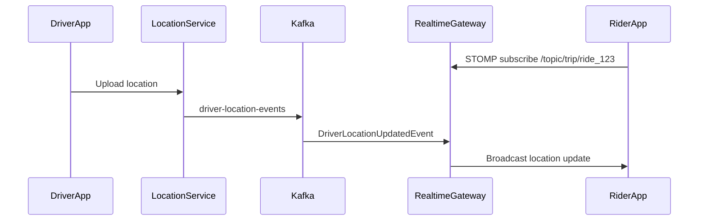
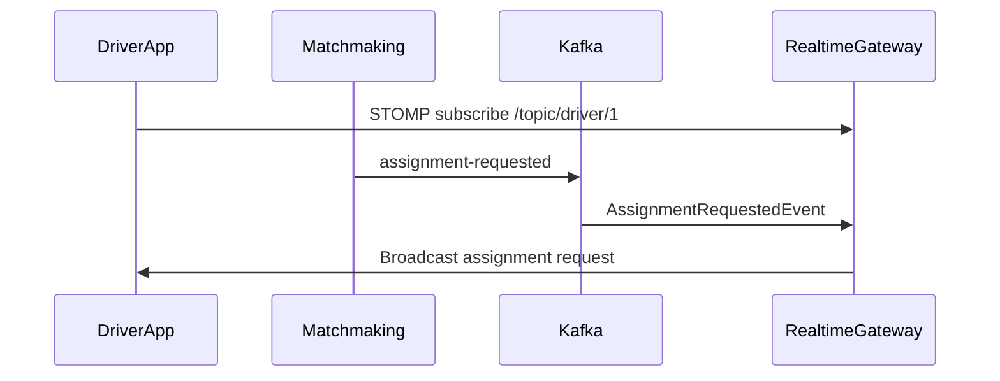

# Realtime Gateway Service

Stateless Kafka to WebSocket/STOMP gateway for Smart Mobility.

## Responsibilities

- Consume `driver-location-events` from Kafka and broadcast to `/topic/trip/{rideId}`.
- Consume `assignment-requested` from Kafka and broadcast to `/topic/driver/{driverId}`.
- Log WebSocket connect, subscribe, and disconnect events.

The service does not ingest driver GPS directly, persist state, replay missed messages, authenticate users, or own ride/driver lifecycle state.

## Project Structure

```text
com.mobility.realtime
├── config
├── controller
├── domain
├── dto
├── exception
├── handler
├── kafka
├── service
├── util
└── websocket
```

## Sequence Diagrams

Rider live trip tracking:



Driver assignment notification:



## Run Locally

Start Kafka:

```bash
docker compose -f ../docker/docker-compose.yml up -d zookeeper kafka kafka-ui
```

Kafka is available at `localhost:9092`.
Kafka UI is available at `http://localhost:8090`.

Create topics:

```bash
docker compose -f ../docker/docker-compose.yml exec kafka kafka-topics \
  --bootstrap-server kafka:29092 \
  --create \
  --if-not-exists \
  --topic driver-location-events \
  --partitions 3 \
  --replication-factor 1

docker compose -f ../docker/docker-compose.yml exec kafka kafka-topics \
  --bootstrap-server kafka:29092 \
  --create \
  --if-not-exists \
  --topic assignment-requested \
  --partitions 3 \
  --replication-factor 1
```

Start the service:

```bash
./mvnw spring-boot:run
```

Open the browser client:

```text
http://localhost:8085/ws-test.html
```

## WebSocket Subscriptions

Rider trip tracking:

```text
/topic/trip/ride_123
```

Driver assignment notifications:

```text
/topic/driver/1
```

## Publish Sample Location Event

```bash
docker compose -f ../docker/docker-compose.yml exec -T kafka kafka-console-producer \
  --bootstrap-server kafka:29092 \
  --topic driver-location-events <<'JSON'
{"driverId":"driver_1","rideId":"ride_123","latitude":28.6139,"longitude":77.2090,"speed":42.0,"heading":120.0,"timestamp":"2026-05-17T12:00:00Z"}
JSON
```

Expected: the rider subscription `/topic/trip/ride_123` receives the JSON event.

## Publish Sample Assignment Event

```bash
docker compose -f ../docker/docker-compose.yml exec -T kafka kafka-console-producer \
  --bootstrap-server kafka:29092 \
  --topic assignment-requested <<'JSON'
{"eventId":"evt_1","eventType":"ASSIGNMENT_REQUESTED","dispatchId":"11111111-1111-1111-1111-111111111111","rideId":"22222222-2222-2222-2222-222222222222","driverId":1,"pickupLatitude":28.6139,"pickupLongitude":77.2090,"pickupLocation":"Connaught Place","expiresAt":"2026-05-17T12:00:15Z"}
JSON
```

Expected: the driver subscription `/topic/driver/1` receives the JSON event.

## Postman WebSocket Setup

Postman raw WebSocket support does not speak STOMP automatically. Use a STOMP-capable client where available, or use `ws-test.html`.

For manual STOMP frames against `ws://localhost:8085/ws`, connect and send:

```text
CONNECT
accept-version:1.2
heart-beat:10000,10000

^@
```

Then subscribe:

```text
SUBSCRIBE
id:sub-0
destination:/topic/trip/ride_123

^@
```

The `^@` marker represents the STOMP null terminator.
